import { Aside } from '@astrojs/starlight/components';

Aspire supports modeling **parent-child relationships** between resources to express ownership, containment, and grouping.

Parent-child relationships serve two purposes:

- **Lifecycle Containment**: The child's execution is tied to the parent's — starting, stopping, and failures cascade from parent to child automatically.
- **Dashboard Visualization**: The child appears **nested beneath** the parent in dashboards and visualizations, improving readability.

### Lifecycle containment

When a resource implements the `IResourceWithParent` interface, it declares **true containment** — meaning its lifecycle is controlled by its parent:

- **Startup**: The child resource will only start after its parent starts (though readiness is independent).
- **Shutdown**: If the parent is stopped or removed, the child is also stopped automatically.
- **Failure Propagation**: If a parent enters a terminal failure state (`FailedToStart`, etc.), dependent children are stopped.

<Aside type="note">
  A logging sidecar container is tied to the lifecycle of a main application
  container — if the main app stops, the logging sidecar is also terminated.
</Aside>

### Visual grouping (without lifecycle impact)

Aspire also supports **visual-only parent-child relationships** using the `WithParentRelationship()` method during resource construction.

Visual relationships:

- Affect **only the dashboard layout**.
- **Do not affect lifecycle** — the resources are independent operationally.
- Improve **clarity** by logically grouping related components.

<Aside type="tip">
  A Redis database container and a Redis Commander admin UI container can be
  grouped visually, even though they start independently.
</Aside>

### Manual Relationships — No Inference

Aspire **does not infer** parent-child relationships automatically based on names, dependencies, or network links.

You must **explicitly declare** relationships by either:

- **Implementing `IResourceWithParent`**: Creates lifecycle dependency and visual nesting.
- **Using `.WithParentRelationship()`**: Creates visual nesting only.

This explicitness ensures developers have full control over resource containment and presentation.

### Real-world scenarios

The following scenarios illustrate how Aspire models parent-child relationships:

| Scenario                                        | Parent             | Child                  |
| ----------------------------------------------- | ------------------ | ---------------------- |
| Main application container with logging sidecar | App container      | Fluentd container      |
| Database with admin dashboard                   | Database container | Admin UI container     |
| Microservice with associated health monitor     | API container      | Health probe container |

## Values and references

In Aspire, configuration, connectivity details, and dependencies between distributed resources are modeled using **structured values**. These values capture relationships explicitly—not just as simple strings—making the application graph **portable, inspectable, and evolvable**.

Aspire represents these relationships through a **heterogeneous Directed Acyclic Graph (DAG)**. This graph tracks not only dependency ordering but also how **structured values** are passed between resources at multiple abstraction levels: configuration, connection, and runtime behavior.

```csharp title="C# — AppHost.cs"
var builder = DistributedApplication.CreateBuilder(args);

var db = builder.AddPostgres("pg");
var api = builder.AddProject("api").WithReference(db);
var web = builder.AddNpmApp("web").WithReference(api);

builder.Build().Run();
```



```mermaid
architecture-beta

  service db(logos:postgresql)[pg]
  service epr(iconoir:server-connection)[Endpoint Reference]
  service api(logos:dotnet)[api]
  service ctr(iconoir:server-connection)[Connection String Reference]
  service frontend(logos:react)[web]

  db:L <-- R:ctr
  ctr:L <-- R:api
  api:L <-- R:epr
  epr:L <-- R:frontend
```

### Special case: Endpoints

Normally, resource references form an acyclic graph — **no cycles allowed**. However, **endpoint references are treated specially** and **may form cycles** intentionally.

Endpoints are modeled as **external entities**:

- They are **not edges** in the resource dependency graph.
- They enable realistic mutual references like:
  - A frontend app and an OIDC server mutually referencing each other's URLs (redirects, login callbacks).
  - A backend exposing CORS settings that reference the frontend URL.

<Aside type="tip">
  Endpoints are managed separately from strict dependency edges to allow
  flexible, real-world service wiring.
</Aside>

### How the DAG forms

Resources connect to each other through:

- **`WithReference()` calls**: Direct resource-to-resource dependencies.
- **Environment variables and CLI arguments**: Configuration values containing structured references.
- **Other configuration sources**: Settings populated with structured value references.

Each reference **adds an edge** to the graph, allowing Aspire to:

- Track dependency ordering.
- Propagate structured values cleanly between services.
- Validate application integrity before execution.

<Aside type="note">
  Aspire **never infers references automatically** — all value flows must be
  explicitly authored by developers.
</Aside>

### Structured vs literal values

Aspire distinguishes between **structured values** and **literal values**.

- **Structured values** preserve meaning (e.g., "this is a service URL" vs. "this is a raw string").
- **Literal values** are inert — they are carried unchanged across modes.

At publish time and run time:

- Structured values are either **resolved** (if possible) or **translated into target artifacts** (e.g., environment variables, argument values, etc.).
- Literal values are simply copied.

<Aside type="caution">
  **Flattening values too early destroys portability, environment substitution,
  and cross-platform compatibility.** Aspire delays flattening as long as
  possible to maintain graph fidelity.
</Aside>

### Value providers and deferred evaluation

Every structured value type in Aspire implements two fundamental interfaces:

| Interface                     | When Used    | Purpose                                                                           |
| ----------------------------- | ------------ | --------------------------------------------------------------------------------- |
| `IValueProvider`              | Run mode     | Resolves live values when the application starts.                                 |
| `IManifestExpressionProvider` | Publish mode | Emits structured expressions (like `{pg.outputs.url}`) into deployment artifacts. |

This dual-interface model enables **deferred evaluation**:

- During **publish**, structured placeholders are emitted — no runtime values are resolved yet.
- During **run**, structured references are resolved to live values like URLs, ports, or connection strings.

Internally, value providers are attached to environment variables, CLI arguments, configuration fields, and other structured outputs during application graph construction.

<Aside type="note">
  Deferred evaluation guarantees that Aspire applications can be **published
  safely**, **deployed flexibly**, and **run consistently** across environments.
</Aside>

### Core value types (expanded)

| Type                          | Represents                                            | Run Mode                                | Publish Mode                                               |
| ----------------------------- | ----------------------------------------------------- | --------------------------------------- | ---------------------------------------------------------- |
| `string`                      | A literal string value.                               | Same literal.                           | Same literal.                                              |
| `EndpointReference`           | A link to a named endpoint on another resource.       | Concrete URL (`http://localhost:5000`). | Target-specific endpoint translation (DNS, ingress, etc.). |
| `EndpointReferenceExpression` | A property of an endpoint (`Host`, `Port`, `Scheme`). | Concrete value.                         | Platform-specific translation.                             |
| `ConnectionStringReference`   | A symbolic pointer to a resource's connection string. | Concrete string.                        | Token or externalized secret.                              |
| `ParameterResource`           | An external input, secret, or setting.                | Local dev value or environment lookup.  | Placeholder `${PARAM}` for substitution.                   |
| `ReferenceExpression`         | A composite string with embedded references.          | Concrete formatted string.              | Format string preserved for substitution.                  |

## `ReferenceExpression`

`ReferenceExpression` preserves **structured value objects**—endpoints, parameters, connection strings, etc.—inside an interpolated string and defers evaluation until it is safe.

Aspire evaluates the model in **two distinct modes**:

| Phase       | `ReferenceExpression` yields                                            |
| ----------- | ----------------------------------------------------------------------- |
| **Publish** | Publisher-specific placeholder text (e.g., `{api.bindings.http.host}`). |
| **Run**     | Concrete value such as `localhost`.                                     |

**Example — Using `ReferenceExpression`:**

```csharp title="C# — AppHost.cs"
var ep = api.GetEndpoint("http");

builder.WithEnvironment("HEALTH_URL",
    ReferenceExpression.Create(
        $"https://{ep.Property(EndpointProperty.Host)}:{ep.Property(EndpointProperty.Port)}/health"
    )
);
```

_Publish manifest excerpt:_

```ini
HEALTH_URL=https://{api.bindings.http.host}:{api.bindings.http.port}/health
```

_Run-time value:_

```ini
HEALTH_URL=https://localhost:5000/health
```

<Aside type="tip">
  **Avoid resolving values directly** — build the string inside
  `ReferenceExpression.Create()` to preserve structure.
</Aside>

### Alternate pattern using `ExecutionContext`

```csharp title="C# — AppHost.cs"
var ep = api.GetEndpoint("http");

if (builder.ExecutionContext.IsRunMode)
{
    builder.WithEnvironment("HEALTH_URL",
        $"{ep.Url}/health"); // concrete
}
else
{
    builder.WithEnvironment("HEALTH_URL",
        ReferenceExpression.Create($"{ep}/health")); // structured
}
```

### Pattern used by `IResourceWithConnectionString`

A common implementation builds the connection string with `ReferenceExpression`, mixing any value objects (endpoint properties, parameters, other references):

```csharp
private static ReferenceExpression BuildConnectionString(
    EndpointReference endpoint,
    ParameterResource  passwordParameter)
{
    var host = endpoint.Property(EndpointProperty.IPV4Host);
    var port = endpoint.Property(EndpointProperty.Port);
    var pwd  = passwordParameter;

    return ReferenceExpression.Create(
        $"Server={host},{port};User ID=sa;Password={pwd};TrustServerCertificate=true");
}
```

### Common errors

The following patterns are common mistakes when using `ReferenceExpression`:

| Error                                  | Correct approach                                        |
| -------------------------------------- | ------------------------------------------------------- |
| Build the string first, wrap later.    | Build **inside** `ReferenceExpression.Create(...)`.     |
| Access `Endpoint.Url` during publish.  | Use `Endpoint.Property(...)` in the expression.         |
| Mix resolved strings and placeholders. | Keep the entire value inside one `ReferenceExpression`. |

## Endpoint primitives

The `EndpointReference` is the fundamental type used to interact with another resource's endpoint. It provides properties such as:

- `Url`: The full URL of the endpoint, e.g., `http://localhost:6379`.
- `Host`: The hostname or IP address of the endpoint.
- `Port`: The port number of the endpoint.

These properties are dynamically resolved during the application's startup sequence. Accessing them before the endpoints are allocated results in an exception.

### `IResourceWithEndpoints`

Resources supporting endpoints should implement `IResourceWithEndpoints`, enabling the use of `GetEndpoint(name)` to retrieve an `EndpointReference`. This is implemented on the built-in `ProjectResource`, `ContainerResource` and `ExecutableResource`. It allows endpoints to be programmatically accessed and passed between resources.

```csharp title="Example — Endpoint Access and Resolution"
var builder = DistributedApplication.CreateBuilder(args);

var redis = builder.AddContainer("redis", "redis")
                   .WithEndpoint(name: "tcp", targetPort: 6379);

// Get a reference to the "tcp" endpoint by name
var endpoint = redis.GetEndpoint("tcp");

builder.Build().Run();
```

### What does "allocated" mean?

An endpoint is **allocated** when Aspire resolves its runtime values (e.g., `Host`, `Port`, `Url`) during **run mode**. Allocation happens as part of the **startup sequence**, ensuring endpoints are ready for use in local development.

In **publish mode**, endpoints are not allocated with concrete values. Instead, their values are represented as **manifest expressions** or bindings (e.g., `{redis.bindings.tcp.host}:{redis.bindings.tcp.port}`) that are resolved by the deployment infrastructure.

#### Comparison: Run Mode vs Publish Mode

| **Context**         | **Run Mode**                             | **Publish Mode**                                                  |
| ------------------- | ---------------------------------------- | ----------------------------------------------------------------- |
| **Endpoint Values** | Fully resolved (`tcp://localhost:6379`). | Represented by manifest expressions (`{redis.bindings.tcp.url}`). |
| **Use Case**        | Local development and debugging.         | Deployed environments (e.g., Kubernetes, Azure, AWS, etc.).       |
| **Behavior**        | Endpoints are allocated dynamically.     | Endpoint placeholders resolve at runtime.                         |

Use the `IsAllocated` property on an `EndpointReference` to check whether an endpoint has been allocated before accessing its runtime values.

### Accessing Allocated Endpoints Safely

Endpoint resolution happens during the startup sequence of the `DistributedApplication`. To safely access endpoint values (e.g., `Url`, `Host`, `Port`), you must wait until endpoints are allocated. Aspire provides eventing APIs, such as `AfterEndpointsAllocatedEvent`, to access endpoints after allocation. These APIs ensure code executes only when endpoints are ready.

```csharp title="Example — Checking Allocation and Using Eventing"
var builder = DistributedApplication.CreateBuilder(args);

// Add a Redis container with a TCP endpoint
var redis = builder.AddContainer("redis", "redis")
                   .WithEndpoint(name: "tcp", targetPort: 6379);

// Retrieve the EndpointReference
var endpoint = redis.GetEndpoint("tcp");

// Check allocation status and access Url
Console.WriteLine($"IsAllocated: {endpoint.IsAllocated}");

try
{
    Console.WriteLine($"Url: {endpoint.Url}");
}
catch (Exception ex)
{
    Console.WriteLine($"Error accessing Url: {ex.Message}");
}

// Subscribe to AfterEndpointsAllocatedEvent for resolved properties
builder.Eventing.Subscribe<AfterEndpointsAllocatedEvent>(
    (@event, cancellationToken) =>
    {
        Console.WriteLine($"Endpoint allocated: {endpoint.IsAllocated}");
        Console.WriteLine($"Resolved Url: {endpoint.Url}");
        return Task.CompletedTask;
    });

// Start the application
builder.Build().Run();
```

The preceding code will output different results depending on whether the application is running in **run mode** or **publish mode**:

**Run Mode**:

```bash title="Run Mode — Console Output"
IsAllocated: True
Resolved Url: http://localhost:6379
```

**Publish Mode**:

```bash title="Publish Mode — Console Output"
IsAllocated: False
Error accessing Url: Endpoint has not been allocated.
```

<Aside type="tip">
  The overloads of `WithEnvironment` that take a callback run after endpoints
  have been allocated.
</Aside>

## Referencing Endpoints from Other Resources

This section covers how to reference endpoints from other resources in Aspire, allowing you to wire up dependencies and configurations effectively.

### Using `WithReference`

The `WithReference` API allows you to pass an endpoint reference directly to a target resource.

```csharp title="C# — AppHost.cs"
var builder = DistributedApplication.CreateBuilder(args);

var redis = builder.AddContainer("redis", "redis")
                   .WithEndpoint(name: "tcp", targetPort: 6379);

builder.AddProject<Projects.Worker>("worker")
       .WithReference(redis.GetEndpoint("tcp"));

builder.Build().Run();
```

`WithReference` is optimized for applications that use service discovery.

### Using `WithEnvironment`

The `WithEnvironment` API exposes endpoint details as environment variables, enabling runtime configuration.

```csharp title="Example — Passing Redis Endpoint as Environment Variable"
var builder = DistributedApplication.CreateBuilder(args);

var redis = builder.AddContainer("redis", "redis")
                   .WithEndpoint(name: "tcp", targetPort: 6379);

builder.AddProject<Worker>("worker")
       .WithEnvironment("RedisUrl", redis.GetEndpoint("tcp"));

builder.Build().Run();
```

`WithEnvironment` gives full control over the configuration names injected into the target resource.

## `EndpointReferenceExpression` — Accessing Endpoint Parts

`EndpointReferenceExpression` represents **one field** of an endpoint (`Host`, `Port`, `Scheme`, etc.).
Call `endpoint.Property(...)` to get that field; the result is still a structured value and stays deferred until publish/run time.

| Need                                    | Pattern                                                |
| --------------------------------------- | ------------------------------------------------------ |
| Only one part (e.g., host)              | `endpoint.Property(EndpointProperty.Host)`             |
| Compose multiple parts into one setting | Build a `ReferenceExpression` (see dedicated section). |

```csharp title="Example — Expose Redis Host and Port"
var redis = builder.AddContainer("redis", "redis")
                   .WithEndpoint("tcp", 6379);

builder.AddProject("worker")
       .WithEnvironment(ctx =>
       {
           var ep = redis.GetEndpoint("tcp");
           ctx.EnvironmentVariables["REDIS_HOST"] = ep.Property(EndpointProperty.Host);
           ctx.EnvironmentVariables["REDIS_PORT"] = ep.Property(EndpointProperty.Port);
       });
```

In this pattern, `ep.Property(...)` returns an `EndpointReferenceExpression`, which is a structured value that will be resolved at runtime.

```csharp title="Example — Build a Full Redis URL"
var ep = redis.GetEndpoint("tcp");

builder.WithEnvironment("REDIS_URL",
    ReferenceExpression.Create(
        $"redis://{ep.Property(EndpointProperty.HostAndPort)}"
    )
);
```

This pattern avoids resolving endpoint values prematurely and works in both publish and run modes.

### `EndpointProperty` API Surface

| Property               | Meaning                                          |
| ---------------------- | ------------------------------------------------ |
| `Url`                  | Fully qualified URL (`scheme://host:port`).      |
| `Host` or `IPV4Host`   | Host name or IPv4 literal.                       |
| `Port` or `TargetPort` | Allocated host port vs. container-internal port. |
| `Scheme`               | `http`, `tcp`, etc.                              |
| `HostAndPort`          | Convenience composite (`host:port`).             |

The `EndpointReference` type exposes live or placeholder values for an endpoint and provides `.Property(...)` to create an `EndpointReferenceExpression`.

Key members:

| Member                                                   | Description                                            |
| -------------------------------------------------------- | ------------------------------------------------------ |
| `Url`, `Host`, `Port`, `Scheme`, `TargetPort`            | Concrete in run mode; undefined in publish mode.       |
| `bool IsAllocated`                                       | Indicates if concrete values are available (run mode). |
| `EndpointReferenceExpression Property(EndpointProperty)` | Creates a deferred expression for one field.           |

`EndpointReferenceExpression` implements the same `IManifestExpressionProvider` / `IValueProvider` pair, so it can be embedded in a `ReferenceExpression` or resolved directly with `GetValueAsync()`.

## Context-based endpoint resolution

Aspire resolves endpoints differently based on the relationship between the source and target resources. This ensures proper communication across all environments.

### Resolution Rules

| **Source**           | **Target**           | **Resolution**                              | **Example URL**             |
| -------------------- | -------------------- | ------------------------------------------- | --------------------------- |
| Container            | Container            | Container network (`resource name:port`).   | `redis:6379`                |
| Executable / Project | Container            | Host network (`localhost:port`).            | `localhost:6379`            |
| Container            | Executable / Project | Host network (`host.docker.internal:port`). | `host.docker.internal:5000` |

#### Advanced Scenario: Dynamic Endpoint Resolution Across Contexts

Aspire resolves endpoints differently based on the execution context (e.g., run mode vs. publish mode, container vs. executable). Sometimes you want to override that resolution behavior.

Consider the following scenario, where the example shows a project that is going to setup up grafana and keycloak. We need to give the project the address for container-to-container communication between grafana and keycloak even though the target resource is a project. The project isn't directly talking to keycloak or grafana, it's a mediator that is just setting URLs in the appropriate configuration of each container.

### Cross-Context Communication Example

The following code demonstrates how to set environment variables for a project that needs to communicate with other resources like Grafana and Keycloak. It ensures that the URLs are correctly resolved based on the execution context (run mode vs. publish mode).

```csharp title="C# — AppHost.cs"
var builder = DistributedApplication.CreateBuilder(args);

var keycloak = builder.AddKeycloak("keycloak", 8080);
var grafana = builder.AddContainer("grafana", "grafana/grafana");

var api = builder.AddProject<Projects.Api>("api")
    .WithEnvironment(ctx =>
    {
        var keyCloakEndpoint = keycloak.GetEndpoint("http");
        var grafanaEndpoint = grafana.GetEndpoint("http");

        ctx.EnvironmentVariables["Grafana__Url"] = grafanaEndpoint;

        if (ctx.ExecutionContext.IsRunMode)
        {
            // The project needs to get the URL for keycloak in the context
            // of the container network, but since this is a project, it'll
            // resolve the url in the context of the host network. We get
            // the runtime url and change the host and port to match the
            // container network pattern (host = resource name, port = target port ?? port)
            var keycloakUrl = new UriBuilder(keyCloakEndpoint.Url)
            {
                Host = keycloak.Resource.Name,
                Port = keyCloakEndpoint.TargetPort ?? keyCloakEndpoint.Port,
            };

            ctx.EnvironmentVariables["Keycloak__AuthServerUrl"] = keycloakUrl.ToString();
        }
        else
        {
            // In publish mode let the endpoint resolver handle the URL
            ctx.EnvironmentVariables["Keycloak__AuthServerUrl"] = keyCloakEndpoint;
        }
    });

builder.Build().Run();
```
