import { Aside, Steps } from '@astrojs/starlight/components';
import LearnMore from '@components/LearnMore.astro';

Aspire's AppHost represents a collection of resources, known as the "resource model". This model allows developers to define and manage the various components and services that make up their applications, providing a unified way to interact with these resources throughout the development lifecycle.

The resource model is a **directed acyclic graph (DAG)**, where resources are nodes and dependencies are edges. This structure allows Aspire to manage complex relationships between resources, ensuring that they can be started, stopped, and monitored in a predictable manner.

## Basic example

A quick example that shows the basic usage:

```csharp title="C# — AppHost.cs"
var builder = DistributedApplication.CreateBuilder(args);

var db = builder.AddPostgres("pg").AddDatabase("appdata");
var api = builder.AddProject<Projects.Api>("api").WithReference(db);
var web = builder.AddNpmApp("web", "../web").WithReference(api);

builder.Build().Run();
```

The preceding `AppHost` code defines an architecture with three resources:

```mermaid
architecture-beta

  service db(logos:postgresql)[pq]
  service api(logos:dotnet)[api]
  service frontend(logos:react)[web]

  api:R --> L:db
  frontend:R --> L:api
```



<Steps>

1. Use `.AddXyz(...)` helper methods to add and declare resources (e.g., `.AddPostgres(...)`, `.AddProject(...)`).
1. Use `.WithReference(...)` (or similar) to represent explicit dependencies between resources.
1. Call `Build().Run()` - Aspire builds the application model (graph) and executes it handling:

   - Port allocation
   - Environment variables
   - Startup order

</Steps>

## Resource basics

In Aspire, a **resource** is the fundamental unit for modeling your distributed applications. Resources represent services, infrastructure elements, or supporting components that together compose a distributed system.

Resources in Aspire implement the `IResource` interface, with most built-in resources deriving from the base `Resource` class.

- Resources are **inert by default** — they are **pure data objects** that describe capabilities, configuration, and relationships. They **do not manage their own lifecycle** (e.g., starting, stopping, checking health). Resource lifecycle is coordinated externally by orchestrators and lifecycle hooks.
- Resources are identified by a **unique name** within the application graph. This name forms the basis for referencing, wiring, and visualizing resources.

### Annotations

Resource metadata is expressed through **annotations**, which are strongly-typed objects implementing the `IResourceAnnotation` interface.

Annotations allow attaching additional structured information to a resource without modifying its core class. They are the **primary extensibility mechanism** in Aspire, enabling:

- Core system behaviors (e.g., service discovery, connection strings, health probes).
- Custom extensions and third-party integrations.
- Layering of optional capabilities without inheritance or tight coupling.

<Aside type="tip">
  Resources might have annotations for environment variables, endpoint information, or service discovery metadata that other resources require.
</Aside>

<LearnMore>
  For additional information on annotations, see [Resource API Patterns: Annotations](/architecture/resource-api-patterns/#annotations).
</LearnMore>

### Fluent extension methods

Resources are typically added using fluent **extension methods** such as `.AddRedis(...)`, `.AddProject(...)`, or `.AddPostgres(...)`. Extension methods encapsulate:

- **Construction** of the resource object.
- **Attachment of annotations** that describe defaults, discovery hints, or runtime behavior.
- **Relationships** like wiring up dependencies (e.g., via `.WithReference(...)`).

This pattern improves the developer experience by:

- Setting **sane defaults** automatically.
- Making **required configuration obvious and discoverable**.
- Providing a **product-like feel** to adding infrastructure.

<Aside type="note">
  Without extension methods, adding a resource manually would require constructing it directly, setting annotations manually, and remembering to wire relationships by hand.
</Aside>

### Adding resources and wiring dependencies

To continue from the previous example, here's how you can add resources and wire them together in the `AppHost`:

```csharp '.WithReference' title="C# — AppHost.cs"
var builder = DistributedApplication.CreateBuilder(args);

var db = builder.AddPostgres("pg").AddDatabase("appdata");
var api = builder.AddProject<Projects.Api>("api").WithReference(db);
var web = builder.AddNpmApp("web", "../web").WithReference(api);

builder.Build().Run();
```

The preceding example:

- A PostgreSQL server (`pg`) is created and configured with a database named `appdata`.
- A backend service (`api`) is created and connected to the database.
- A frontend app (`web`) is created and reverse-proxies traffic to the backend.

Each resource participates in the application graph passively, with dependencies expressed through references.

### Key takeaways

Resources **describe** capabilities rather than controlling them directly. **Annotations** provide a rich, extensible metadata system for resources, while **fluent extension methods** guide developers toward correct and complete configurations. **Names** serve as the identity anchors for wiring and dependency resolution throughout the application graph.

## Built-in resources and lifecycle

In Aspire, many common infrastructure and application patterns are available as **built-in resource types**. Built-in resources simplify modeling real-world systems by providing ready-made building blocks that automatically integrate with the Aspire runtime, lifecycle management, health tracking, and dashboard visualization.

Built-in resources:

- Handle **lifecycle transitions** automatically.
- Raise **lifecycle events** (like startup and readiness signals).
- Push **status updates** to the system for real-time orchestration and monitoring.
- Expose **endpoints, environment variables, and metadata** needed for dependent resources.

They help developers express distributed applications **consistently** without needing to manually orchestrate startup, shutdown, and dependency wiring.

### Known resource states

All resources in Aspire begin in an `Unknown` state when added to the application graph. This ensures that the **resource graph can be fully constructed** before any execution, dependency resolution, or publishing occurs.

| State | Meaning |
|--|--|
| `Exited` | Completed execution (typically for short-lived jobs, migrations, one-shot tasks). |
| `FailedToStart` | Failed during startup initialization. |
| `Finished` | Ran to successful completion (used for batch workloads or scripts). |
| `Hidden` | Present in the model but intentionally hidden from dashboard UI (e.g., infrastructure helpers). |
| `NotStarted` | Defined but not yet scheduled to start. |
| `Running` | Successfully started; may have separate application-level health probing. |
| `RuntimeUnhealthy` | The container or host runtime environment (e.g., Docker daemon) is unavailable, preventing start-up. |
| `Starting` | Actively starting; readiness not yet confirmed. |
| `Stopping` | Resource is shutting down gracefully. |
| `Unknown` | Default state when first added to the graph. No execution planned yet. |
| `TerminalStates` | List of terminal states (e.g., `Finished`, `Exited`, `FailedToStart`). |
| `Waiting` | Awaiting dependencies to become ready (e.g., using `.WaitFor(...)`). |

Resource states drive:

- **Readiness checks** to unblock dependent resources.
- **Dashboard visualization** and state coloring.
- **Orchestration sequencing** for startup and shutdown.
- **Health monitoring** at runtime.

### Built-in types

Aspire provides a set of fundamental built-in resource types that serve as the foundation for modeling execution units:

| Type                 | Purpose                                                 |
|----------------------|---------------------------------------------------------|
| `ContainerResource`  | Runs Docker containers as resources.                    |
| `ExecutableResource` | Launches arbitrary executables or scripts as resources. |
| `ProjectResource`    | Runs a .NET project directly (build + launch workflow). |
| `ParameterResource`  | Represents a parameter or configuration value.          |

These types are **infrastructure-oriented primitives**. They model how code and applications are packaged and executed.

<Aside type="note">
  Specialized services like Redis, Postgres, or RabbitMQ are **not** true "built-in" resource types in Aspire core — they are typically provided through external packages or extensions that build on `ContainerResource` or custom resource types.
</Aside>

Built-in types:

- Automatically participate in resource orchestration.
- Raise standard lifecycle events without manual intervention.
- Report health and readiness status.
- Expose connection endpoints for dependent services.

Custom resources must **opt-in manually** to these behaviors.

### Well-known lifecycle events

Aspire defines standard events to orchestrate resource lifecycles, in the following order:

<Steps>

1. `InitializeResourceEvent`: Fired when a resource is first created to kick off the resource's lifecycle.
1. `ConnectionStringAvailableEvent`: Fired when a connection string is ready, enabling dependent resources to wire themselves dynamically based on the resource's outputs.
1. `ResourceEndpointsAllocatedEvent`: Fired when endpoints have been allocated and can be evaluated successfully.
1. `BeforeResourceStartedEvent`: Fired just before the resource starts executing as a last-chance dynamic setup or validation point.
1. `ResourceReadyEvent`: Fired when the resource is considered "ready," unblocking any dependents waiting for the resource.

</Steps>

Lifecycle events allow:

- Dynamic reconfiguration just before startup.
- Dependent resource activation based on readiness.
- Wiring services together based on runtime-generated outputs.

<Aside type="caution">
  Event publishing is **synchronous and blocking** — event handlers can delay further execution.
</Aside>

### Status reporting

Beyond events, Aspire uses **asynchronous state snapshots** to report resource status continuously.

- `ResourceNotificationService` handles snapshot updates.
- Status updates involve:
  1. Receiving the previous immutable snapshot.
  2. Mutating to a new snapshot representing the updated state.
  3. Publishing the new snapshot to the dashboard and orchestrators.

Snapshots:

- Always reflect the **latest known status**.
- Are **non-blocking** and do not delay orchestration.
- Drive **dashboard visualization** and orchestration decisions.

<Aside type="note">
Events represent **moment-in-time actions**. Snapshots represent **ongoing state**.
</Aside>

### Resource health

Aspire integrates with .NET health checks to monitor the status of resources after they have started. The health check mechanism is tied into the resource lifecycle:

<Steps>

1. When a resource transitions to the `Running` state, Aspire checks if it has any associated health check annotations (typically added via `.WithHealthCheck(...)`).
1. **If health checks are configured:** Aspire begins executing these checks periodically. The resource is considered fully "ready" only after its health checks pass successfully. Once healthy, Aspire automatically publishes the `ResourceReadyEvent`.
1. **If no health checks are configured:** The resource is considered "ready" as soon as it enters the `Running` state. Aspire automatically publishes the `ResourceReadyEvent` immediately in this case.

</Steps>

This automatic handling ensures that dependent resources (using mechanisms like `.WaitFor(...)`) only proceed when the target resource is truly ready, either by simply running or by passing its defined health checks.

<Aside type="danger">
  Developers should **not** manually publish the `ResourceReadyEvent`. Aspire manages the transition to the ready state based on the presence and outcome of health checks. Manually firing this event can interfere with the orchestration logic.
</Aside>

### Resource logging

Aspire supports logging output on a per-resource basis, which is displayed in the console window and can be surfaced in the dashboard. This log stream is especially useful for monitoring what a resource is doing in real time.

For built-in resources, Aspire captures and forwards output from:

- `stdout` and `stderr` of containers (e.g., Docker).
- Process output from executables or .NET projects.

For custom resources, developers can write directly to a resource's log using the `ResourceLoggerService`.

This service provides an `ILogger` scoped to the individual resource instance, enabling human-readable, contextual logging.

```csharp
var logger = resourceLoggerService.GetLogger(myResource);
logger.LogInformation("Starting provisioning…");
```

<Aside type="note">
A full example demonstrating custom resource logging with the Talking Clock resource can be found in the [Full Examples](/architecture/resource-examples/) section.
</Aside>

#### Common resource logging APIs

The following APIs are likely to be used when working with resource logging:

| API                                          | Description                 |
|----------------------------------------------|-----------------------------|
| `ResourceLoggerService.GetLogger(IResource)` | Returns a scoped `ILogger`. |
| `ResourceLoggerService.WatchAsync`           | Stream log lines.           |

Resource logs are designed to be human-readable and provide insights into the resource's behavior, state changes, and any issues encountered during execution. Use the `ResourceNotificationService` to publish structured state changes.

## Standard interfaces

Aspire defines a set of **optional standard interfaces** that allow resources to declare their capabilities in a structured, discoverable way. Implementing these interfaces enables **dynamic wiring, publishing, service discovery, and orchestration** without hardcoded type knowledge.

These interfaces are the foundation for Aspire's polymorphic behaviors — enabling tools, publishers, and the runtime to treat resources uniformly based on what they can do, rather than what they are.

### Benefits of standard interfaces

- **Dynamic discovery:** Tooling and runtime systems can automatically adapt based on resource capabilities.
- **Loose coupling:** Behaviors (like environment wiring, service discovery, or connection sharing) are opt-in.
- **Extensibility:** New resource types can integrate seamlessly into the Aspire ecosystem by implementing one or more interfaces.

### Common interfaces

| Interface | Purpose |
|-----------|---------|
| `IResourceWithArgs` | Supplies additional CLI arguments when launching a project or executable. |
| `IResourceWithConnectionString` | Provides a connection string output for consumers to connect to the resource. |
| `IResourceWithEndpoints` | Exposes ports, URLs, or connection points that other resources can consume. |
| `IResourceWithEnvironment` | Supports setting environment variables for the resource. |
| `IResourceWithServiceDiscovery` | Registers a service hostname and metadata for discovery by other resources. |
| `IResourceWithWaitSupport` | This resource can wait for other resources. |
| `IResourceWithWithoutLifetime` | This resource does not have a lifecycle. (e.g. connection string, parameter) |

### Examples per interface

**`IResourceWithEnvironment`**

```csharp
builder.WithEnvironment("MY_SETTING", "value");
```

Allows setting environment variables that are passed to the resource when it starts.

**`IResourceWithServiceDiscovery`**

```csharp
builder.WithReference(myResourceWithDiscovery);
```

Exposes the resource via DNS-style service discovery. Downstream resources can refer to it by logical name.

**`IResourceWithEndpoints`**

```csharp
builder.GetEndpoint("http");
```

When a resource implements `IResourceWithEndpoints`, it allows referencing specific endpoints (e.g., `http`, `tcp`) for reverse proxies or connection targets.

**`IResourceWithConnectionString`**

```csharp
builder.WithReference(myDatabaseResource);
```

Allows wiring a database connection string into environment variables, configurations, or CLI arguments.

**`IResourceWithArgs`**

```csharp
builder.WithArgs("2", "--url", endpoint);
```

Allows setting command-line arguments on the resource.

**`IResourceWithWaitSupport`**

```csharp
builder.WaitFor(otherResource)
```

This resource can wait on other resources. A `ParameterResource` is an example of resources that cannot wait.

<Aside type="note">
These APIs and behaviors are defined in the [📦 Aspire.Hosting](https://www.nuget.org/packages/Aspire.Hosting) package.
</Aside>

### Importance of polymorphism

By modeling behaviors through interfaces rather than concrete types, Aspire enables:

- **Tooling flexibility**: Publishers can wire environment variables, endpoints, and arguments generically.
- **Runtime uniformity**: Dashboards and orchestrators treat resources based on capabilities, not type-specific logic.
- **Ecosystem extensibility**: New resource types can plug into the system without modifying core code.

Interfaces allow Aspire to remain **open, flexible, and adaptable** as new types of services, platforms, and deployment targets emerge.
