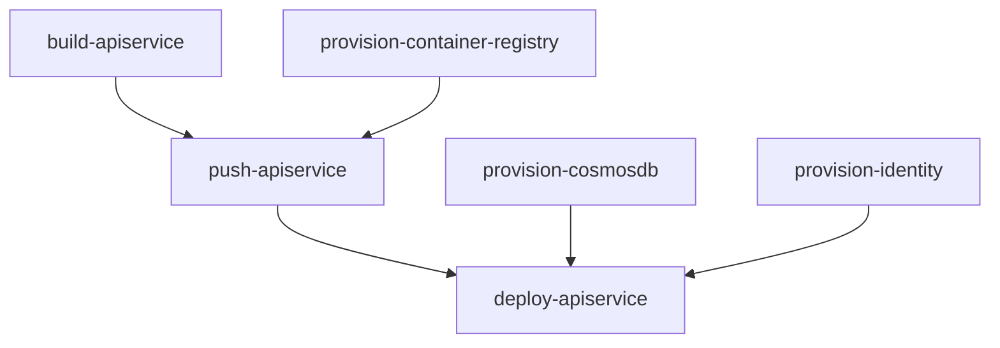

import LearnMore from '@components/LearnMore.astro';
import { Aside, Code, Steps, LinkButton } from "@astrojs/starlight/components";

Thank you for your interest in contributing to `aspire.dev`! Whether you're fixing typos, adding new content, or improving existing pages, this guide will help you get started and your contributions are greatly appreciated.

## 🚀 About this site

This documentation site is built using [Starlight](https://starlight.astro.build/), a full-featured documentation theme built on top of [Astro](https://astro.build/). Starlight provides a fast, accessible, and SEO-friendly foundation, while Astro's component-based architecture makes it easy to create and maintain content.

## 📋 Prerequisites

Before you begin, ensure you have the following installed:

- [Node.js](https://nodejs.org/en/download) (LTS version recommended) - For running the development server
- [pnpm](https://pnpm.io/installation) - Fast, disk space efficient package manager
- [Visual Studio Code](https://code.visualstudio.com/) - Recommended code editor
- [Git](https://git-scm.com/downloads) - For version control

## ⚙️ Local dev setup

<Steps>

1. Clone the `aspire.dev` repository.

    ```bash
    git clone https://github.com/microsoft/aspire.dev.git
    ```

1. Navigate to the `aspire.dev` directory.

    ```bash
    cd aspire.dev
    ```

1. Install dependencies

    ```bash
    pnpm install
    ```

1. Run the development server

    ```bash
    pnpm dev
    ```

    This starts the Vite development server for the front end and provide hot-reload capabilities.

1. View the site locally

    Open your browser to `http://localhost:4321` (or the port shown in your terminal)

</Steps>

## 🧹 Code quality checks

Before committing your changes, ensure your code follows the project's style guidelines by running the linting and formatting commands:

- **Lint your code** - Check for code quality issues:

    ```bash
    pnpm lint
    ```

- **Format your code** - Auto-format your code to match the project's style:

    ```bash
    pnpm format
    ```

<Aside type="tip">
  Run `pnpm format` before committing to automatically fix formatting issues. The lint command will help identify potential problems in your code.
</Aside>

## ➡️ Git workflow

<Steps>

1. Start from an issue (or a discussion that leads to an issue)
1. Fork the repository

    As mentioned in the local dev setup section, start by forking the `aspire.dev` repository to your own GitHub account
 
1. Create a new branch for your changes

    ```bash
    git checkout -b feature/your-feature-name
    ```

1. Make your changes, considering the writing style guide
1. Run lint and format commands to ensure code quality

    ```bash
    pnpm lint
    pnpm format
    ```

1. Commit with descriptive messages
1. Push to your fork
1. Create a pull request, and always follow the [Code of Conduct](https://github.com/microsoft/aspire.dev/blob/main/CODE_OF_CONDUCT.md)

</Steps>

## ✍️ Writing style guide

When contributing to `aspire.dev`, follow these writing guidelines to ensure consistency and clarity:

- **Use clear and concise language** - Aim for simplicity. Avoid jargon unless necessary, and explain technical terms when they first appear.
- **Be consistent** - Follow existing conventions in terminology, formatting, and structure. Refer to other documentation pages for examples.
- **Use active voice** - Write in active voice to make instructions and explanations more direct and engaging.
- **Use sentence case** - Capitalize only the first word and proper nouns in headings, sidebars, and table of contents.
- **Be inclusive** - Use inclusive language that respects all readers. Avoid gendered terms and stereotypes.
- **Provide examples** - Where applicable, include code snippets or examples to illustrate concepts.
- **Use proper grammar and spelling** - Proofread your contributions to ensure they are free of errors and typos.
- **Structure content logically** - Use headings, subheadings, and lists to organize information in a way that is easy to follow.
- **Link to relevant resources** - When mentioning concepts, tools, or related documentation, provide links to help readers find more information.
- **Follow formatting conventions** - Use consistent formatting for code snippets, commands, and technical terms. Refer to the examples in this guide for guidance.
- **Review existing content** - Before adding new content, review existing documentation to avoid duplication and ensure coherence.

## 📝 Write Markdown

Here are some common Markdown formatting examples to help you write documentation:

### Frontmatter

You can customize individual pages in `aspire.dev` by setting values in their frontmatter.
Frontmatter is set at the top of your files between `---` separators:

```md title="src/content/docs/example.md"
---
title: My page title
---

Page content follows the second `---`.
```

Every page must include at least a `title`. See the [frontmatter reference](https://aspire.dev.astro.build/reference/frontmatter/) for all available fields and how to add custom fields.

### Headings

Use `#` symbols to create headings. More `#` symbols create smaller headings:

```md title="src/content/docs/example.md"
## Heading 2
### Heading 3
#### Heading 4
```

Headings are automatically created as bookmarks (shareable deep links) for easy navigation.

<Aside type="note">
  Avoid using Heading 1 (`#`) in your content, as it is reserved for the page title defined in frontmatter.
</Aside>

<Aside type="tip">
  To configure which headings appear in the **On this page** sidebar, use the `tableOfContents` frontmatter field. See the [tableOfContents reference](https://aspire.dev.astro.build/reference/frontmatter/) for more details.
</Aside>

### Text formatting

**Bold text** is created with double asterisks:

```md title="src/content/docs/example.md"
**Bold text**
```

_Italic text_ is created with an `_` (or single asterisks `*`—while valid, for consistency we recommend using `_`):

```md title="src/content/docs/example.md"
_Italic text_
```

`Inline code` is created with backticks:

```md title="src/content/docs/example.md"
`Inline code`
```

### Links

Links are created with square brackets and parentheses:

```md title="src/content/docs/example.md"
[David Pine](https://davidpine.net)
```

Renders as:

[David Pine](https://davidpine.net)

Additionally, when linking to other pages within `aspire.dev`, use site relative paths:

```md title="src/content/docs/example.md"
[Build your first Aspire app](/get-started/first-app/)
```

Renders as:

[Build your first Aspire app](/get-started/first-app/)

:::note
Site relative links should always include a trailing slash `/` at the end to ensure proper navigation.
<LearnMore>
This is confugred by default for `aspire.dev`, for more information see [Astro Docs: trailingSlash](https://docs.astro.build/en/reference/configuration-reference/#trailingslash).
</LearnMore>
:::

### Lists

Unordered lists use `-` (or `*`—while valid, for consistency we recommend using `-`):

```md title="src/content/docs/example.md"
- First item
- Second item
- Third item
```

Renders as:

- First item
- Second item
- Third item

Ordered lists use numbers:

```md title="src/content/docs/example.md"
1. First step
1. Second step
1. Third step
```

Renders as:

1. First step
2. Second step
3. Third step

<Aside type="note">
  Use `1.` for all items in an ordered list—Markdown will automatically number them correctly.
</Aside>

### Code blocks

Use triple backticks with a language identifier for syntax highlighting:

````md title="src/content/docs/example.md"
```csharp title="C# — AppHost.cs"
var builder = DistributedApplication.CreateBuilder(args);
builder.AddProject<Projects.ApiService>("apiservice");
```
````

Renders as:

```csharp title="C# — AppHost.cs"
var builder = DistributedApplication.CreateBuilder(args);
builder.AddProject<Projects.ApiService>("apiservice");
```

To add a title to a code block, use this syntax:

````md title="src/content/docs/example.md"
```csharp title="Program.cs"
var builder = DistributedApplication.CreateBuilder(args);
builder.AddProject<Projects.ApiService>("apiservice");
```
````

Renders as:

```csharp title="Program.cs"
var builder = DistributedApplication.CreateBuilder(args);
builder.AddProject<Projects.ApiService>("apiservice");
```

### Blockquotes

Use `>` to create blockquotes:

```md title="src/content/docs/example.md"
> This is a note or important callout.
```

Renders as:

> This is a note or important callout.

### Tables

Create tables using pipes `|` and hyphens `-`:

```md title="src/content/docs/example.md"
| Feature | Description | Status |
|--|--|--|
| Dashboard | Web-based monitoring | ✅ Available |
| Telemetry | OpenTelemetry support | ✅ Available |
| Deployment | Kubernetes deployment | 🚧 Preview |
```

Renders as:

| Feature | Description | Status |
|--|--|--|
| Dashboard | Web-based monitoring | ✅ Available |
| Telemetry | OpenTelemetry support | ✅ Available |
| Deployment | Kubernetes deployment | 🚧 Preview |

<Aside type="tip">
  You can align columns using colons: `| :--- |` for left, `| :---: |` for center, and `| ---: |` for right alignment.
</Aside>

### Horizontal rules

Create a horizontal rule with three or more hyphens, asterisks, or underscores:

```md title="src/content/docs/example.md"
---
```

Renders as:

---

### Strikethrough

Use double tildes to create strikethrough text:

```md title="src/content/docs/example.md"
~~This text is crossed out~~
```

Renders as:

~~This text is crossed out~~

### Task lists

Create interactive task lists in Markdown:

```md
- [x] Add Aspire to your project
- [x] Configure service defaults
- [ ] Deploy to Azure
- [ ] Set up monitoring
```

Renders as:

- [x] Add Aspire to your project
- [x] Configure service defaults
- [ ] Deploy to Azure
- [ ] Set up monitoring

### Nested lists

You can nest lists by indenting with two spaces:

```md
- Aspire components
  - Databases
    - PostgreSQL
    - Redis
  - Messaging
    - RabbitMQ
    - Azure Service Bus
```

Renders as:

- Aspire components
  - Databases
    - PostgreSQL
    - Redis
  - Messaging
    - RabbitMQ
    - Azure Service Bus

### Escaping characters

Use a backslash `\` to escape special Markdown characters:

```md
\*This text is not italic\*
\[This is not a link\]
```

Renders as:

\*This text is not italic\*
\[This is not a link\]

### Line breaks

End a line with two or more spaces to create a line break:

```md
First line with two spaces at the end  
Second line
```

Or use an empty line to create a paragraph break.

## ➕ Markdown extensions

The `aspire.dev` site supports several Markdown extensions to enhance your documentation:

### Mermaid diagrams

You can write mermaid diagrams as code blocks:

````md title="src/content/docs/example.md"

````

Renders as:


### Asides

[Asides](https://starlight.astro.build/components/asides/), "admonitions", "callouts", or "alerts" are special highlighted blocks used to draw attention to important information, tips, warnings, or notes.

The `:::` syntax creates asides given a type of `note`, `tip`, `caution`, or `danger` in both Markdown and [MDX](#write-mdx):

````md title="src/content/docs/example.md"
:::note
Some content in an aside.
:::

:::caution
Some cautionary content.
:::

:::caution

Other content is also supported in asides.

```js
// A code snippet, for example.
```

:::

:::danger
Do not give your password to anyone.
:::
````

Renders as:

:::note
Some content in an aside.
:::

:::caution
Some cautionary content.
:::

:::caution

Other content is also supported in asides.

```js
// A code snippet, for example.
```

:::

:::danger
Do not give your password to anyone.
:::

Additionally, `aspire.dev` supports [GitHub Alerts](https://docs.github.com/en/get-started/writing-on-github/getting-started-with-writing-and-formatting-on-github/basic-writing-and-formatting-syntax#alerts) syntax with the [community plugin](https://starlight-github-alerts.netlify.app/getting-started/):

For example, you can write:

#### Note

```md title="src/content/docs/example.md"
> [!NOTE]
> Useful information that users should know, even when skimming content.
```

Renders as:

> [!NOTE]
> Useful information that users should know, even when skimming content.

See the full demo here: [Starlight: GitHub Alerts](https://starlight-github-alerts.netlify.app/demo/).

<LearnMore>
For the Starlight component, see the [Aside component](#aside-component) section below.
</LearnMore>

## ☑️ Write MDX

<p id="write-mdx"></p>

MDX files use the `.mdx` extension and combine standard Markdown with the power of JSX. This means you can write content and seamlessly embed interactive components—all in one file.

<LearnMore>
[Learn more about MDX](https://mdxjs.com/docs/what-is-mdx/).
</LearnMore>

With the power of Astro components, you can enhance your documentation with interactive elements, custom layouts, and dynamic content. To use any of the built-in Starlight or custom components available in `aspire.dev`, simply import them at the top of your MDX file and use them like regular JSX components.

### LinkButton component

```mdx title="src/content/docs/example.mdx"
---
title: Example MDX Page
---

import { LinkButton } from '@astrojs/starlight/components';

Here's an example of an MDX page with a custom button:

<LinkButton href="https://aspire.dev" variant="primary">
  Visit aspire.dev
</LinkButton>
```

Renders as:

Here's an example of an MDX page with a custom button:

<LinkButton href="https://aspire.dev" variant="primary">
  Visit aspire.dev
</LinkButton>

<LearnMore>
For all available components, see: [Starlight: Components](https://starlight.astro.build/components/using-components/).
</LearnMore>

### Aside component

The `Aside` component from Starlight can be used to create asides in your documentation:

````mdx title="src/content/docs/example.mdx"
---
title: Example MDX Page
---

import { Aside } from '@astrojs/starlight/components';

<Aside>Some content in an aside.</Aside>

<Aside type="caution">Some cautionary content.</Aside>

<Aside type="tip">

  Other content is also supported in asides.

  ```js
  // A code snippet, for example.
  ```

</Aside>

<Aside type="danger">Do not give your password to anyone.</Aside>
````

Renders as:

<Aside>Some content in an aside.</Aside>

<Aside type="caution">Some cautionary content.</Aside>

<Aside type="tip">

Other content is also supported in asides.

```js
// A code snippet, for example.
```

</Aside>

<Aside type="danger">Do not give your password to anyone.</Aside>

### Using custom components

import tsConfig from "../../../../tsconfig.json?raw";

To use custom components available in `aspire.dev`, import them at the top of your MDX file. Custom component imports rely on configured aliases—have a look at the `tsconfig.json` file for more information:

<Code code={tsConfig} lang="json" title="JSON — tsconfig.json" mark={8} />

By using the `@components` alias, you can easily import any custom component from the `frontend/src/components/` directory. For example, to import the `LearnMore` component used in this guide:

```mdx title="src/content/docs/example.mdx"
---
title: Example MDX Page
---

import LearnMore from '@components/LearnMore.astro';

Here's an example of using the `LearnMore` component:

<LearnMore>
  Please give our [repository a star on GitHub! ⭐](https://github.com/microsoft/aspire.dev)
</LearnMore>
```

Renders as:

Here's an example of using the `LearnMore` component:

<LearnMore>
  Please give our [repository a star on GitHub! ⭐](https://github.com/microsoft/aspire.dev)
</LearnMore>

## 🆘 Getting help

- **Issues** - Report bugs or request features via [GitHub Issues](https://github.com/microsoft/aspire.dev/issues)
- **Discussions** - Join conversations in [GitHub Discussions](https://github.com/microsoft/aspire.dev/discussions)
- **Discord** - Connect with the community on the [Aspire Discord](https://discord.com/invite/raNPcaaSj8)