import { Aside, Code, FileTree, Steps, TabItem, Tabs } from '@astrojs/starlight/components';
import LearnMore from '@components/LearnMore.astro';
import SimpleAppHostCode from '@components/SimpleAppHostCode.astro';

Aspire's AppHost is the code-first place where you declare your application's services and their relationships. Instead of managing scattered configuration files, you describe the architecture in code. Aspire then handles local orchestration so you can focus on building features.

## Defining your architecture

Consider a simple three-tier architecture where the front end talks to an API, and the API talks to a database:

```mermaid
architecture-beta

  service db(logos:postgresql)[PostgreSQL]
  service api(logos:dotnet)[API service]
  service frontend(logos:react)[React front end]

  api:R --> L:db
  frontend:R --> L:api
```

You can represent that architecture in an AppHost like this:

<SimpleAppHostCode />

Aspire presents the same, consistent model regardless of the language or framework used: services, resources, and the connections between them.

### Dissecting the AppHost code

Below we highlight the key parts of a typical AppHost to explain what each step does.

<SimpleAppHostCode collapse={['3-16']} />

In the non-collapsed lines you:

<Steps>

1. Create the distributed application builder with `DistributedApplication.CreateBuilder(args)`.
1. Call `Build()` to materialize the configuration into a runnable AppHost.
1. Call `Run()` to start orchestration; services launch in dependency order.

</Steps>

The AppHost is the blueprint for your distributed application—Aspire manages the rest.

#### Adding a PostgreSQL resource

With the builder ready, define resources and services. The snippet below shows how to add a PostgreSQL server and a database:

<SimpleAppHostCode mark={{ range: '4-6' }} collapse={['8-18']} />

How this works:

- `AddPostgres("db")` registers a PostgreSQL container named `db`.
  - This returns an `IResourceBuilder<PostgresServerResource>` so you can chain configuration fluent-style.
- `.AddDatabase("appdata")` creates a database named `appdata` on that server.
- `.WithDataVolume()` provisions a volume so data persists across container restarts.

<LearnMore>
  Learn more about the official [PostgreSQL integration](/integrations/databases/postgres/).
</LearnMore>

#### Adding an API resource and declaring a dependency

Next, register the API service and wire it to the PostgreSQL resource:

<SimpleAppHostCode mark={{ range: '9-11' }} collapse={['1-6', '13-18']} />

What this does:

- `AddProject<Projects.Api>("api")` registers the API project as a service named `api`.
- `WithReference(postgres)` injects connection details (host, port, credentials, connection string) into the API configuration.
- `WaitFor(postgres)` delays the API startup until PostgreSQL is healthy, avoiding brittle startup timing issues.

Now that the `api` service is defined, you can attach the front end.

#### Adding a front end resource

Register the front end project, declare its dependency on the API, and let the AppHost provide the API address automatically.

<Aside type="note">
This example uses a Node.js (React) front end, but Aspire treats front ends as executable services—any language or framework works.
</Aside>

<SimpleAppHostCode mark={{ range: '14-16' }} collapse={['1-11']} />

Key points:

- `.AddViteApp("front end", "../frontend")` registers the (Vite-based) front end project as a service named `front end`.
- `.WithHttpEndpoint(env: "PORT", targetPort: 3000)` exposes the app on port `3000`; the `PORT` environment variable can override it.
- `.WithReference(api)` injects the API base address into the front end configuration.

In short: define the backend first (DB → API), then point the UI at the API. The AppHost captures the dependency graph, connection flows, and startup order.

#### Configuration and networking

These dependencies and connections are automatically managed by Aspire. The AppHost generates configuration values like connection strings and endpoints, injecting them into services as needed. in the AppHost when you add resources, you name them (e.g., `db`, `api`, `front end`); Aspire uses these names for DNS resolution, so services can communicate using predictable addresses. Consuming services also rely on these names for configuration injection.

```mermaid
architecture-beta

  service db(logos:postgresql)[pg]
  service epr(iconoir:server-connection)[Endpoint Reference]
  service api(logos:dotnet)[api]
  service ctr(iconoir:server-connection)[Connection String Reference]
  service frontend(logos:react)[front end]

  db:L <-- R:ctr
  ctr:L <-- R:api
  api:L <-- R:epr
  epr:L <-- R:frontend
```

**How these resources communicate**

<Steps>

1. `pg` publishes a `ConnectionStringReference` (host, port, database, user, password)—a strongly typed bundle Aspire understands.
1. `api` declares a dependency on that reference; Aspire injects the connection string into its config with a unique configuration-flow process that injects settings values, including secrets, parameters, and connection strings for both local runs and deployments.
1. `api` then publishes an `EndpointReference` (its base URL) after its HTTP endpoint is allocated.
1. `front end` depends on that endpoint; Aspire injects the API base URL so no hard-coded addresses are needed.

</Steps>

<Aside type="tip">
Aspire replaces ad-hoc run scripts, scattered environment variables, and fragile copy-pasted connection strings with a single, declarative source of truth. By modeling services, resources, and their dependencies in code, it delivers typed configuration (endpoints, credentials, connection strings) directly where needed—reducing setup drift, accelerating onboarding, and letting you evolve the architecture without rewriting glue.
</Aside>

## How the AppHost works

When you run the AppHost, Aspire performs these core responsibilities:

<Steps>

1. **Service discovery**: Aspire discovers services and resources declared in the AppHost.
1. **Dependency resolution**: Services start in the correct order based on declared dependencies.
1. **Configuration injection**: Connection strings, endpoints, and other config values are injected automatically.
1. **Health monitoring**: Aspire observes service health and can restart services when necessary.

</Steps>

<LearnMore>
  Dive deeper into Aspire's orchestration and the [Resource model](/architecture/resource-model/).
</LearnMore>

## AppHost structure

The template AppHost is structured in the following ways:

<Tabs syncKey="apphost-type">
  <TabItem label="File-based AppHost" icon="seti:c-sharp">
    <FileTree>
    - **AspireApp.AppHost**
        - apphost.cs  dev-time orchestrator
        - apphost.run.json
    </FileTree>
  </TabItem>
  <TabItem label="Project-based AppHost" icon="seti:html">
    <FileTree>
    - **AspireApp.AppHost**
        - Properties
          - launchSettings.json
        - appsettings.Development.json
        - appsettings.json
        - AspireApp.AppHost.csproj
        - AppHost.cs  dev-time orchestrator
    </FileTree>
  </TabItem>
</Tabs>

## AppHost lifecycle events

You can hook into lifecycle events to run custom logic during startup and resource allocation.

<Steps>

1. `BeforeStartEvent`: Raised before the AppHost begins starting services.
1. `AfterEndpointsAllocatedEvent`: Raised after endpoints are allocated for services.
1. `AfterResourcesCreatedEvent`: Raised after all resources are created.

</Steps>

<LearnMore>
  For finer-grained lifecycle control, see the [well-known lifecycle events](/architecture/resource-model/#well-known-lifecycle-events).
</LearnMore>

## Best practices

- Keep the AppHost minimal to start; add complexity only as required.
- Define explicit dependencies with `.WithReference(...)` to make wiring obvious.
- Use separate configurations for development, testing, and production.
- Pick clear, descriptive names for resources to make debugging and logging easier.
