import { Image } from 'astro:assets';
import { Aside, Code, CardGrid, LinkCard, Steps, Tabs, TabItem, Icon, FileTree } from '@astrojs/starlight/components';
import { Kbd } from 'starlight-kbd/components'
import Expand from '@components/Expand.astro';
import LearnMore from '@components/LearnMore.astro';
import InstallPackage from '@components/InstallPackage.astro';
import PivotSelector from '@components/PivotSelector.astro';
import Pivot from '@components/Pivot.astro';
import ThemeImage from '@components/ThemeImage.astro';

import azureIcon from '@assets/icons/azure-icon.png';
import dockerIcon from '@assets/icons/docker.svg';

<PivotSelector
    title="Select your programming language to get started"
    key="lang"
    options={[
        { id: "csharp", title: "C#" },
        { id: "python", title: "Python" },
        { id: "javascript", title: "JavaScript (coming soon)", disabled: true },
    ]}
/>

In this tutorial, you take the app you created in the [Build your first Aspire app](/get-started/first-app/) quickstart and deploy it. This can be broken down into several key steps:

<Steps>

1. [Add deployment package](#add-deployment-package) — Add the hosting package for your target.
1. [Update your AppHost](#update-your-apphost) — Configure the environment API.
1. [Deploy your app](#deploy-your-app) — Deploy using the Aspire CLI.
1. [Verify your deployment](#verify-your-deployment) — Ensure your app is running as expected.
1. [Clean up resources](#clean-up-resources) — Remove any deployed resources to avoid incurring costs.

</Steps>

The following diagram shows the architecture of the sample app you're deploying:

```mermaid
architecture-beta
    group api-docker(logos:docker-icon)[API container]
    group f-docker(logos:docker-icon)[Front end container]

    service api(logos:dotnet)[API service] in api-docker
    service http(iconoir:server-connection)[https]
    service frontend(aspire:blazor)[Blazor front end] in f-docker

    frontend:L --> R:http
    http:L --> R:api
```

<Pivot id="csharp">


The ASP.NET Core Blazor & Minimal API starter template consists of two resources, each deployed as a separate container.

```mermaid
architecture-beta
  group docker(logos:docker-icon)[Python and static site server container]  

  service api(logos:fastapi)[API service] in docker
  service http(iconoir:server-connection)[https] in docker
  service frontend(logos:react)[React front end] in docker

  frontend:L --> R:http
  http:L --> R:api
```

</Pivot>
<Pivot id="python">



The React (Vite) & FastAPI starter template consists of two resources that are deployed as a single container. The FastAPI server hosts both the API and the static frontend files generated by React.
</Pivot>

## Prerequisites

<Tabs syncKey="deploy-target">
    <TabItem id="docker-compose" label="Docker Compose">
        <div class="sl-flex sl-gap-4 sl-items-center sl-mb-4">
            <div>
                <Image src={dockerIcon} alt="Docker logo" class="icon md" data-zoom-off />
            </div>
            - [Docker Desktop](https://www.docker.com/products/docker-desktop) installed and running.
            - [Podman (alternative to Docker)](https://podman.io/getting-started/installation) installed and running. For more information, see [OCI-compatible container runtime](/get-started/prerequisites/#install-an-oci-compliant-container-runtime).
        </div>
    </TabItem>
    <TabItem id="azure" label="Azure">
        <div class="sl-flex sl-gap-4 sl-items-center sl-mb-4">
        <div>
            <Image src={azureIcon} alt="Azure logo" class="icon md" data-zoom-off />
        </div>
        - An [Azure account](https://azure.microsoft.com/free/) with an active subscription.
        - [Azure CLI](https://learn.microsoft.com/cli/azure/install-azure-cli) installed and configured. You should be logged in using `az login`.
        </div>
    </TabItem>    
</Tabs>

## Add deployment package

In the root directory of your Aspire solution that you created in the previous quickstart, add the appropriate hosting deployment package by running the following command in your terminal:

<Tabs syncKey="deploy-target">
    <TabItem id="docker-compose" label="Docker Compose">

        [Docker Compose](https://docs.docker.com/compose/) is a tool for defining and running multi-container Docker applications. It allows you to use a YAML file to configure your application's services, networks, and volumes, making it easier to manage and deploy complex applications locally or in various environments.

        ```bash title="Aspire CLI — Add Docker Compose"
        aspire add docker
        ```

        The Aspire CLI is interactive, be sure to select the appropriate search result for the [📦 Aspire.Hosting.Docker](https://www.nuget.org/packages/Aspire.Hosting.Docker) version you want to add.

    </TabItem>
    <TabItem id="azure" label="Azure">

        ```bash title="Aspire CLI — Add Azure App Containers"
        aspire add azure-appcontainers
        ```

        The Aspire CLI is interactive, be sure to select the appropriate search result for the [📦 Aspire.Hosting.Azure.AppContainers](https://www.nuget.org/packages/Aspire.Hosting.Azure.AppContainers) version you want to add.

    </TabItem>

    If prompted for additional selections, use the <Kbd windows="↑" mac="↑" /> and <Kbd windows="↓" mac="↓" /> keys to navigate the options. Press <Kbd windows="Enter" mac="Return" /> to confirm your selection.

    <LearnMore>
    Learn more about the `aspire add` command in the [reference docs](/reference/cli/commands/aspire-add/).
    </LearnMore>
</Tabs>

## Update your AppHost

In the AppHost, be sure to add the appropriate environment API.

<Tabs syncKey="deploy-target">
    <TabItem id="docker-compose" label="Docker Compose">

        <Pivot id="csharp">
            ```csharp title="C# — AppHost.cs project-based orchestrator" {3-4} ".WithExternalHttpEndpoints()"
            var builder = DistributedApplication.CreateBuilder(args);

            // Add the following line to configure the Docker Compose environment
            builder.AddDockerComposeEnvironment("env");

            var apiService = builder.AddProject<Projects.AspireApp_ApiService>("apiservice")
                .WithHttpHealthCheck("/health");

            builder.AddProject<Projects.AspireApp_Web>("webfrontend")
                .WithExternalHttpEndpoints()
                .WithHttpHealthCheck("/health")
                .WithReference(apiService)
                .WaitFor(apiService);

            builder.Build().Run();
            ```
        </Pivot>
        <Pivot id="python">
            ```csharp title="C# — apphost.cs file-based orchestrator" {4,8-9} ".WithExternalHttpEndpoints()"
            #:sdk Aspire.AppHost.Sdk@13.0.0
            #:package Aspire.Hosting.JavaScript@13.0.0
            #:package Aspire.Hosting.Python@13.0.0
            #:package Aspire.Hosting.Docker@13.0.0

            var builder = DistributedApplication.CreateBuilder(args);

            // Add the following line to configure the Docker Compose environment
            builder.AddDockerComposeEnvironment("env");

            var app = builder.AddUvicornApp("app", "./app", "main:app")
                .WithUv()
                .WithExternalHttpEndpoints()
                .WithHttpHealthCheck("/health");

            var frontend = builder.AddViteApp("frontend", "./frontend")
                .WithReference(app)
                .WaitFor(app);

            app.PublishWithContainerFiles(frontend, "./static");

            builder.Build().Run();
            ```
        </Pivot>

        - `AddDockerComposeEnvironment` — Configures the Docker Compose environment for deployment. This call implicitly adds support for containerizing resources in the AppHost as part of deployment.
        - `WithExternalHttpEndpoints` — Exposes HTTP endpoints for the resource when deployed.

    </TabItem>
    <TabItem id="azure" label="Azure">

        <Pivot id="csharp">
            ```csharp title="C# — AppHost.cs project-based orchestrator" {3-4} ".WithExternalHttpEndpoints()"
            var builder = DistributedApplication.CreateBuilder(args);

            // Add the following line to configure the Azure App Container environment
            builder.AddAzureContainerAppEnvironment("env");

            var apiService = builder.AddProject<Projects.AspireApp_ApiService>("apiservice")
                .WithHttpHealthCheck("/health");

            builder.AddProject<Projects.AspireApp_Web>("webfrontend")
                .WithExternalHttpEndpoints()
                .WithHttpHealthCheck("/health")
                .WithReference(apiService)
                .WaitFor(apiService);

            builder.Build().Run();
            ```
        </Pivot>
        <Pivot id="python">
            ```csharp title="C# — apphost.cs file-based orchestrator" {4,8-9} ".WithExternalHttpEndpoints()"
            #:sdk Aspire.AppHost.Sdk@13.0.0
            #:package Aspire.Hosting.JavaScript@13.0.0
            #:package Aspire.Hosting.Python@13.0.0
            #:package Aspire.Hosting.Azure.AppContainers@13.0.0

            var builder = DistributedApplication.CreateBuilder(args);

            // Add the following line to configure the Azure App Container environment
            builder.AddAzureContainerAppEnvironment("env");

            var app = builder.AddUvicornApp("app", "./app", "main:app")
                .WithUv()
                .WithExternalHttpEndpoints()
                .WithHttpHealthCheck("/health");

            var frontend = builder.AddViteApp("frontend", "./frontend")
                .WithReference(app)
                .WaitFor(app);

            app.PublishWithContainerFiles(frontend, "./static");

            builder.Build().Run();
            ```
        </Pivot>

        - `AddAzureContainerAppEnvironment` — Configures the Azure App Container environment for deployment. This call implicitly adds support for containerizing resources in the AppHost as part of deployment.
        - `WithExternalHttpEndpoints` — Exposes HTTP endpoints for the resource when deployed.

    </TabItem>
</Tabs>

<Aside type="tip" title="CLI protip" icon="forward-slash">
After installing a new deployment package, you can run `aspire do diagnostics` in your terminal to see the available deploy steps. For more information, see the [aspire do diagnostics](/reference/cli/commands/aspire-do/) reference docs.
</Aside>

## Deploy your app

Now that you've added the deployment package and updated your AppHost, you can deploy your Aspire app.

```bash title="Aspire CLI — Deploy your app"
aspire deploy
```

When you call `aspire deploy`, the Aspire CLI builds the container images for your resources, pushes them to the target environment (if applicable), and deploys the resources according to the configuration in your AppHost.

<Aside type="note" title="Common pitfall..." icon="seti:todo">
If you call `aspire deploy` and you see output similar to the following, be sure that you've actually [updated your AppHost](#update-your-apphost) to include the appropriate environment API for your target. This output indicates that there are no deploy steps configured for your target environment.

```bash title="Aspire CLI - Empty deployment output"
14:17:26 (pipeline execution) → Starting pipeline execution...
14:17:26 (deploy) → Starting deploy...
14:17:26 (deploy) ✓ deploy completed successfully
14:17:26 (pipeline execution) ✓ Completed successfully
------------------------------------------------------------
✓ 2/2 steps succeeded • Total time: 0.0s

Steps Summary:
   0.0 s  ✓ pipeline execution
   0.0 s  ✓ deploy

✓ PIPELINE SUCCEEDED
------------------------------------------------------------
```
</Aside>

<Tabs syncKey="deploy-target">

    <TabItem id="docker-compose" label="Docker Compose">

    Deploying to Docker Compose builds the container images and starts the services locally using Docker Compose. Consider the following example output:

    <Pivot id="csharp">
    
    <Expand summary="Example output for deploying ASP.NET Core/Blazor app to Docker Compose"
            backgroundColor="--sl-color-bg">

    ```bash title="Aspire CLI - Deploy ASP.NET Core/Blazor app with Docker Compose"
    14:28:15 (pipeline execution) → Starting pipeline execution...
    14:28:15 (build-prereq) → Starting build-prereq...
    14:28:15 (publish-env) → Starting publish-env...
    14:28:15 (deploy-prereq) → Starting deploy-prereq...
    14:28:15 (build-prereq) ✓ build-prereq completed successfully
    14:28:15 (deploy-prereq) i [INF] Initializing deployment for environment 'Production'
    14:28:15 (publish-env) i [INF] Generating Compose output
    14:28:15 (deploy-prereq) i [INF] Setting default deploy tag 'aspire-deploy-20251107202815' for compute resource(s).
    14:28:15 (deploy-prereq) ✓ deploy-prereq completed successfully
    14:28:15 (build-webfrontend) → Starting build-webfrontend...
    14:28:15 (build-apiservice) → Starting build-apiservice...
    14:28:15 (publish-env) → Writing the Docker Compose file to the output path.
    14:28:15 (build-webfrontend) i [INF] Building container image for resource webfrontend
    14:28:15 (build-apiservice) i [INF] Building container image for resource apiservice
    14:28:15 (build-webfrontend) i [INF] Building image: webfrontend
    14:28:15 (publish-env) ✓ Docker Compose file written successfully to .\AspireApp\AspireApp.AppHost\aspire-output\docker-compose.yaml. (0.0s)
    14:28:15 (publish-env) ✓ publish-env completed successfully
    14:28:15 (publish) → Starting publish...
    14:28:15 (publish) ✓ publish completed successfully
    14:28:28 (build-webfrontend) i [INF] Building image for webfrontend completed
    14:28:28 (build-apiservice) i [INF] Building image: apiservice
    14:28:28 (build-webfrontend) ✓ build-webfrontend completed successfully
    14:28:32 (build-apiservice) i [INF] Building image for apiservice completed
    14:28:32 (build-apiservice) ✓ build-apiservice completed successfully
    14:28:32 (build) → Starting build...
    14:28:32 (build) ✓ build completed successfully
    14:28:32 (prepare-env) → Starting prepare-env...
    14:28:32 (prepare-env) ✓ prepare-env completed successfully
    14:28:32 (docker-compose-up-env) → Starting docker-compose-up-env...
    14:28:32 (docker-compose-up-env) → Running docker compose up for env
    14:28:35 (docker-compose-up-env) ✓ Service env is now running with Docker Compose locally (2.3s)
    14:28:35 (docker-compose-up-env) ✓ docker-compose-up-env completed successfully
    14:28:35 (deploy) → Starting deploy...
    14:28:35 (deploy) ✓ deploy completed successfully
    14:28:35 (pipeline execution) ✓ Completed successfully
    ------------------------------------------------------------
    ✓ 11/11 steps succeeded • Total time: 20.0s

    Steps Summary:
    19.9 s  ✓ pipeline execution
    17.6 s  ✓ build-apiservice
    12.9 s  ✓ build-webfrontend
    2.3 s  ✓ docker-compose-up-env
    0.0 s  ✓ publish-env
    0.0 s  ✓ deploy-prereq
    0.0 s  ✓ build-prereq
    0.0 s  ✓ build
    0.0 s  ✓ prepare-env
    0.0 s  ✓ deploy
    0.0 s  ✓ publish

    ✓ PIPELINE SUCCEEDED
    ------------------------------------------------------------
    ```

    </Expand>

    </Pivot>
    <Pivot id="python">

    <Expand summary="Example output for deploying Python/React app to Docker Compose"
            backgroundColor="--sl-color-bg">

    ```bash title="Aspire CLI - Deploy Python/React app with Docker Compose"
    13:23:29 (pipeline execution) → Starting pipeline execution...
    13:23:29 (publish-env) → Starting publish-env...
    13:23:29 (build-prereq) → Starting build-prereq...
    13:23:29 (deploy-prereq) → Starting deploy-prereq...
    13:23:29 (build-prereq) ✓ build-prereq completed successfully
    13:23:29 (deploy-prereq) i [INF] Initializing deployment for environment 'Production'
    13:23:29 (publish-env) i [INF] Generating Compose output
    13:23:29 (deploy-prereq) i [INF] Setting default deploy tag 'aspire-deploy-20251107192329' for compute resource(s).
    13:23:29 (deploy-prereq) ✓ deploy-prereq completed successfully
    13:23:29 (build-frontend) → Starting build-frontend...
    13:23:29 (build-frontend) i [INF] Building container image for resource frontend
    13:23:29 (build-frontend) i [INF] Building image: frontend
    13:23:29 (publish-env) → Writing the Docker Compose file to the output path.
    13:23:29 (publish-env) ✓ Docker Compose file written successfully to ./aspire-app/aspire-output/docker-compose.yaml. (0.0s)
    13:23:29 (publish-env) ✓ publish-env completed successfully
    13:23:29 (publish) → Starting publish...
    13:23:29 (publish) ✓ publish completed successfully
    13:23:51 (build-frontend) i [INF] docker buildx for frontend:5ee04da8ac438e73afdb5ab3a7b551d3be1a5feb succeeded.
    13:23:51 (build-frontend) i [INF] Building image for frontend completed
    13:23:51 (build-frontend) ✓ build-frontend completed successfully
    13:23:51 (build-app) → Starting build-app...
    13:23:51 (build-app) i [INF] Building container image for resource app
    13:23:51 (build-app) i [INF] Building image: app
    13:24:07 (build-app) i [INF] docker buildx for app:5d592d0c1d2f417b0c14c4c4a9efb4f0760be8e4 succeeded.
    13:24:07 (build-app) i [INF] Building image for app completed
    13:24:07 (build-app) ✓ build-app completed successfully
    13:24:07 (build) → Starting build...
    13:24:07 (build) ✓ build completed successfully
    13:24:07 (prepare-env) → Starting prepare-env...
    13:24:07 (prepare-env) ✓ prepare-env completed successfully
    13:24:07 (docker-compose-up-env) → Starting docker-compose-up-env...
    13:24:07 (docker-compose-up-env) → Running docker compose up for env
    13:24:13 (docker-compose-up-env) ✓ Service env is now running with Docker Compose locally (5.6s)
    13:24:13 (docker-compose-up-env) ✓ docker-compose-up-env completed successfully
    13:24:13 (deploy) → Starting deploy...
    13:24:13 (deploy) ✓ deploy completed successfully
    13:24:13 (pipeline execution) ✓ Completed successfully
    ------------------------------------------------------------
    ✓ 11/11 steps succeeded • Total time: 44.1s

    Steps Summary:
    44.0 s  ✓ pipeline execution
    22.2 s  ✓ build-frontend
    16.3 s  ✓ build-app
    5.6 s  ✓ docker-compose-up-env
    0.0 s  ✓ publish-env
    0.0 s  ✓ deploy-prereq
    0.0 s  ✓ build-prereq
    0.0 s  ✓ deploy
    0.0 s  ✓ build
    0.0 s  ✓ prepare-env
    0.0 s  ✓ publish

    ✓ PIPELINE SUCCEEDED
    ------------------------------------------------------------
    ```

    </Expand>

    </Pivot>

    </TabItem>
    <TabItem id="azure" label="Azure">

    When deploying to Azure, the `aspire deploy` command is interactive. To avoid prompts (for example, when running in CI/CD), set the following environment variables:

    - `Azure__SubscriptionId`: Target Azure subscription ID.
    - `Azure__Location`: Azure region (for example, eastus).
    - `Azure__ResourceGroup`: Resource group name to create or reuse.

    Deploying to Azure App Containers builds the container images and deploys the services to Azure App Containers. Consider the following example output:

    <Pivot id="csharp">

    <Expand summary="Example output for deploying ASP.NET Core/Blazor app to Azure App Containers"
            backgroundColor="--sl-color-bg">

    ```bash title="Aspire CLI - Deploy ASP.NET Core/Blazor app to Azure App Containers"
    09:19:34 (pipeline execution) → Starting pipeline execution...
    09:19:34 (deploy-prereq) → Starting deploy-prereq...
    09:19:34 (build-prereq) → Starting build-prereq...
    09:19:34 (build-prereq) ✓ build-prereq completed successfully
    09:19:34 (deploy-prereq) i [INF] Initializing deployment for environment 'Production'
    09:19:34 (deploy-prereq) i [INF] Deployment state will be loaded from:
      %USERPROFILE%\.aspire\deployments\{AppHost:Sha}\production.json
    09:19:34 (deploy-prereq) i [INF] Setting default deploy tag 'aspire-deploy-20251110151934' for compute resource(s).
    09:19:34 (deploy-prereq) ✓ deploy-prereq completed successfully
    09:19:34 (validate-azure-login) → Starting validate-azure-login...
    09:19:34 (build-webfrontend) → Starting build-webfrontend...
    09:19:34 (build-apiservice) → Starting build-apiservice...
    09:19:34 (build-apiservice) i [INF] Building container image for resource apiservice
    09:19:34 (build-webfrontend) i [INF] Building container image for resource webfrontend
    09:19:34 (build-apiservice) i [INF] Building image: apiservice
    09:19:36 (validate-azure-login) ✓ Azure CLI authentication validated successfully
    09:19:36 (create-provisioning-context) → Starting create-provisioning-context...
    09:19:36 (create-provisioning-context) i [INF] Using DefaultAzureCredential for provisioning.
    09:19:38 (create-provisioning-context) i [INF] Default subscription: {SUB_NAME} subscription (/subscriptions/xxxxxxxx-xxxx-xxxx-xxxx-xxxxxxxxxxxx)
    09:19:38 (create-provisioning-context) i [INF] Tenant: xxxxxxxx-xxxx-xxxx-xxxx-xxxxxxxxxxxx
    09:19:38 (create-provisioning-context) i [INF] Using existing resource group pinesharp-rg.
    09:19:39 (create-provisioning-context) ✓ create-provisioning-context completed successfully
    09:19:39 (provision-env) → Starting provision-env...
    09:19:39 (provision-env) → Deploying env
    09:19:39 (provision-env) ✓ Using existing deployment for env (0.1s)
    09:19:39 (provision-env) ✓ provision-env completed successfully
    09:19:39 (login-to-acr-env) → Starting login-to-acr-env...
    09:19:39 (login-to-acr-env) → Logging in to envacrdwu3vj6ylvngg
    09:19:41 (login-to-acr-env) i [INF] Start processing HTTP request POST https://envacrdwu3vj6ylvngg.azurecr.io/oauth2/exchange
    09:19:41 (login-to-acr-env) i [INF] Sending HTTP request POST https://envacrdwu3vj6ylvngg.azurecr.io/oauth2/exchange
    09:19:41 (login-to-acr-env) i [INF] Received HTTP response headers after 224.2336ms - 200
    09:19:41 (login-to-acr-env) i [INF] End processing HTTP request after 234.3842ms - 200
    09:19:43 (login-to-acr-env) i [INF] Docker login to envacrdwu3vj6ylvngg.azurecr.io succeeded.
    09:19:43 (login-to-acr-env) ✓ Successfully logged in to envacrdwu3vj6ylvngg.azurecr.io (3.5s)
    09:19:43 (login-to-acr-env) ✓ login-to-acr-env completed successfully
    09:19:44 (build-apiservice) i [INF] Building image for apiservice completed
    09:19:44 (build-webfrontend) i [INF] Building image: webfrontend
    09:19:44 (build-apiservice) ✓ build-apiservice completed successfully
    09:19:44 (push-apiservice) → Starting push-apiservice...
    09:19:44 (push-apiservice) → Pushing apiservice to envacrdwu3vj6ylvngg
    09:19:45 (push-apiservice) i [INF] Docker tag for apiservice -> envacrdwu3vj6ylvngg.azurecr.io/apiservice:aspire-deploy-20251110151934 succeeded.
    09:19:54 (build-webfrontend) i [INF] Building image for webfrontend completed
    09:19:54 (build-webfrontend) ✓ build-webfrontend completed successfully
    09:19:54 (push-webfrontend) → Starting push-webfrontend...
    09:19:54 (push-webfrontend) → Pushing webfrontend to envacrdwu3vj6ylvngg
    09:19:55 (push-webfrontend) i [INF] Docker tag for webfrontend -> envacrdwu3vj6ylvngg.azurecr.io/webfrontend:aspire-deploy-20251110151934 succeeded.
    09:21:04 (push-apiservice) i [INF] Docker push for envacrdwu3vj6ylvngg.azurecr.io/apiservice:aspire-deploy-20251110151934 succeeded.
    09:21:04 (push-apiservice) ✓ Successfully pushed apiservice to envacrdwu3vj6ylvngg.azurecr.io/apiservice:aspire-deploy-20251110151934 (79.7s)
    09:21:04 (push-apiservice) ✓ push-apiservice completed successfully
    09:21:04 (provision-apiservice-containerapp) → Starting provision-apiservice-containerapp...
    09:21:04 (provision-apiservice-containerapp) → Deploying apiservice-containerapp
    09:21:04 (push-webfrontend) i [INF] Docker push for envacrdwu3vj6ylvngg.azurecr.io/webfrontend:aspire-deploy-20251110151934 succeeded.
    09:21:04 (push-webfrontend) ✓ Successfully pushed webfrontend to envacrdwu3vj6ylvngg.azurecr.io/webfrontend:aspire-deploy-20251110151934 (70.9s)
    09:21:04 (push-webfrontend) ✓ push-webfrontend completed successfully
    09:21:04 (provision-webfrontend-containerapp) → Starting provision-webfrontend-containerapp...
    09:21:04 (provision-webfrontend-containerapp) → Deploying webfrontend-containerapp
    09:21:44 (provision-webfrontend-containerapp) ✓ Successfully provisioned webfrontend-containerapp (39.9s)
    09:21:44 (provision-webfrontend-containerapp) ✓ provision-webfrontend-containerapp completed successfully
    09:21:44 (print-webfrontend-summary) → Starting print-webfrontend-summary...
    09:21:44 (print-webfrontend-summary) i [INF] Successfully deployed webfrontend to https://webfrontend.nicesea-f33ccead.centralus.azurecontainerapps.io
    09:21:44 (print-webfrontend-summary) ✓ print-webfrontend-summary completed successfully
    09:21:49 (provision-apiservice-containerapp) ✓ Successfully provisioned apiservice-containerapp (45.4s)
    09:21:49 (provision-apiservice-containerapp) ✓ provision-apiservice-containerapp completed successfully
    09:21:49 (provision-azure-bicep-resources) → Starting provision-azure-bicep-resources...
    09:21:49 (provision-azure-bicep-resources) ✓ provision-azure-bicep-resources completed successfully
    09:21:49 (print-dashboard-url-env) → Starting print-dashboard-url-env...
    09:21:49 (print-apiservice-summary) → Starting print-apiservice-summary...
    09:21:49 (print-apiservice-summary) i [INF] Successfully deployed apiservice to Azure Container Apps environment env. No public endpoints were configured.
    09:21:49 (print-apiservice-summary) ✓ print-apiservice-summary completed successfully
    09:21:49 (print-dashboard-url-env) ✓ Dashboard available at dashboard URL
    09:21:49 (deploy) → Starting deploy...
    09:21:49 (deploy) ✓ deploy completed successfully
    09:21:49 (pipeline execution) ✓ Completed successfully
    ------------------------------------------------------------
    ✓ 18/18 steps succeeded • Total time: 134.8s

    Steps Summary:
    134.8 s  ✓ pipeline execution
    79.7 s  ✓ push-apiservice
    70.9 s  ✓ push-webfrontend
    45.4 s  ✓ provision-apiservice-containerapp
    39.9 s  ✓ provision-webfrontend-containerapp
    19.1 s  ✓ build-webfrontend
    9.7 s  ✓ build-apiservice
    3.5 s  ✓ login-to-acr-env
    3.2 s  ✓ create-provisioning-context
    1.5 s  ✓ validate-azure-login
    0.1 s  ✓ provision-env
    0.0 s  ✓ deploy-prereq
    0.0 s  ✓ print-dashboard-url-env
    0.0 s  ✓ print-apiservice-summary
    0.0 s  ✓ print-webfrontend-summary
    0.0 s  ✓ provision-azure-bicep-resources
    0.0 s  ✓ build-prereq
    0.0 s  ✓ deploy

    ✓ PIPELINE SUCCEEDED
    ------------------------------------------------------------

    ```

    </Expand>

    </Pivot>
    <Pivot id="python">

    <Expand summary="Example output for deploying Python/React app to Azure App Containers"
            backgroundColor="--sl-color-bg">

    ```bash title="Aspire CLI - Deploy Python/React app to Azure App Containers"
    09:24:18 (pipeline execution) → Starting pipeline execution...
    09:24:18 (deploy-prereq) → Starting deploy-prereq...
    09:24:18 (build-prereq) → Starting build-prereq...
    09:24:18 (deploy-prereq) i [INF] Initializing deployment for environment 'Production'
    09:24:18 (build-prereq) ✓ build-prereq completed successfully
    09:24:18 (deploy-prereq) i [INF] Deployment state will be loaded from:
      $HOME/.aspire/deployments/{AppHost:Sha256}/production.json
    09:24:18 (deploy-prereq) i [INF] Setting default deploy tag 'aspire-deploy-20251110152418' for compute resource(s).
    09:24:18 (deploy-prereq) ✓ deploy-prereq completed successfully
    09:24:18 (validate-azure-login) → Starting validate-azure-login...
    09:24:18 (build-frontend) → Starting build-frontend...
    09:24:18 (build-frontend) i [INF] Building container image for resource frontend
    09:24:18 (build-frontend) i [INF] Building image: frontend
    09:24:19 (validate-azure-login) ✓ Azure CLI authentication validated successfully
    09:24:19 (create-provisioning-context) → Starting create-provisioning-context...
    09:24:19 (create-provisioning-context) i [INF] Using DefaultAzureCredential for provisioning.
    09:24:21 (create-provisioning-context) i [INF] Default subscription: {SUB_NAME} subscription (/subscriptions/xxxxxxxx-xxxx-xxxx-xxxx-xxxxxxxxxxxx)
    09:24:21 (create-provisioning-context) i [INF] Tenant: xxxxxxxx-xxxx-xxxx-xxxx-xxxxxxxxxxxx
    09:24:21 (create-provisioning-context) i [INF] Using existing resource group pinethon-rg.
    09:24:22 (create-provisioning-context) ✓ create-provisioning-context completed successfully
    09:24:22 (provision-env) → Starting provision-env...
    09:24:22 (provision-env) → Deploying env
    09:24:22 (provision-env) ✓ Using existing deployment for env (0.0s)
    09:24:22 (provision-env) ✓ provision-env completed successfully
    09:24:22 (login-to-acr-env) → Starting login-to-acr-env...
    09:24:22 (login-to-acr-env) → Logging in to envacrkolahqusw5xw6
    09:24:22 (build-frontend) i [INF] docker buildx for frontend:2288f09e7ab91348b0092685454d4864f32f778f succeeded.
    09:24:22 (build-frontend) i [INF] Building image for frontend completed
    09:24:22 (build-frontend) ✓ build-frontend completed successfully
    09:24:22 (build-app) → Starting build-app...
    09:24:22 (build-app) i [INF] Building container image for resource app
    09:24:22 (build-app) i [INF] Building image: app
    09:24:23 (login-to-acr-env) i [INF] Start processing HTTP request POST https://envacrkolahqusw5xw6.azurecr.io/oauth2/exchange
    09:24:23 (login-to-acr-env) i [INF] Sending HTTP request POST https://envacrkolahqusw5xw6.azurecr.io/oauth2/exchange
    09:24:24 (login-to-acr-env) i [INF] Received HTTP response headers after 341.5701ms - 200
    09:24:24 (login-to-acr-env) i [INF] End processing HTTP request after 351.3163ms - 200
    09:24:25 (login-to-acr-env) i [INF] Docker login to envacrkolahqusw5xw6.azurecr.io succeeded.
    09:24:25 (login-to-acr-env) ✓ Successfully logged in to envacrkolahqusw5xw6.azurecr.io (3.2s)
    09:24:25 (login-to-acr-env) ✓ login-to-acr-env completed successfully
    09:24:27 (build-app) i [INF] docker buildx for app:023f0ae2975b959c9ce3f3a45c13a739c0841b16 succeeded.
    09:24:27 (build-app) i [INF] Building image for app completed
    09:24:27 (build-app) ✓ build-app completed successfully
    09:24:27 (push-app) → Starting push-app...
    09:24:27 (push-app) → Pushing app to envacrkolahqusw5xw6
    09:24:28 (push-app) i [INF] Docker tag for app:023f0ae2975b959c9ce3f3a45c13a739c0841b16 -> envacrkolahqusw5xw6.azurecr.io/app:aspire-deploy-20251110152418 succeeded.
    09:25:06 (push-app) i [INF] Docker push for envacrkolahqusw5xw6.azurecr.io/app:aspire-deploy-20251110152418 succeeded.
    09:25:06 (push-app) ✓ Successfully pushed app to envacrkolahqusw5xw6.azurecr.io/app:aspire-deploy-20251110152418 (38.5s)
    09:25:06 (push-app) ✓ push-app completed successfully
    09:25:06 (provision-app-containerapp) → Starting provision-app-containerapp...
    09:25:06 (provision-app-containerapp) → Deploying app-containerapp
    09:25:29 (provision-app-containerapp) ✓ Successfully provisioned app-containerapp (23.6s)
    09:25:29 (provision-app-containerapp) ✓ provision-app-containerapp completed successfully
    09:25:29 (print-app-summary) → Starting print-app-summary...
    09:25:29 (provision-azure-bicep-resources) → Starting provision-azure-bicep-resources...
    09:25:29 (provision-azure-bicep-resources) ✓ provision-azure-bicep-resources completed successfully
    09:25:29 (print-dashboard-url-env) → Starting print-dashboard-url-env...
    09:25:29 (print-app-summary) i [INF] Successfully deployed app to {DEPLOY_URL}
    09:25:29 (print-app-summary) ✓ print-app-summary completed successfully
    09:25:29 (print-dashboard-url-env) ✓ Dashboard available at dashboard URL
    09:25:29 (deploy) → Starting deploy...
    09:25:29 (deploy) ✓ deploy completed successfully
    09:25:29 (pipeline execution) ✓ Completed successfully
    ------------------------------------------------------------
    ✓ 15/15 steps succeeded • Total time: 71.6s

    Steps Summary:
    71.5 s  ✓ pipeline execution
    38.5 s  ✓ push-app
    23.6 s  ✓ provision-app-containerapp
    4.8 s  ✓ build-frontend
    4.7 s  ✓ build-app
    3.2 s  ✓ login-to-acr-env
    3.1 s  ✓ create-provisioning-context
    1.3 s  ✓ validate-azure-login
    0.0 s  ✓ provision-env
    0.0 s  ✓ deploy-prereq
    0.0 s  ✓ print-app-summary
    0.0 s  ✓ build-prereq
    0.0 s  ✓ print-dashboard-url-env
    0.0 s  ✓ provision-azure-bicep-resources
    0.0 s  ✓ deploy

    ✓ PIPELINE SUCCEEDED
    ------------------------------------------------------------
    ```

    </Expand>
    
    </Pivot>

    </TabItem>
</Tabs>

<LearnMore>
Additional information about this command can be found in the [`aspire deploy`](/reference/cli/commands/aspire-deploy/) reference docs.
</LearnMore>

### Post deployment output

After a deployment, the Aspire CLI writes to the provided output path (or the default output path if none is provided) a set of files based on your deployment target. This may include files such as Docker Compose files, Kubernetes manifests, or cloud provider-specific configuration files.

<Tabs syncKey="deploy-target">
    <TabItem id="docker-compose" label="Docker Compose">

    <Pivot id="csharp">
        <FileTree>
        - aspire-output
          - .env
          - .env.Production
          - docker-compose.yaml
        </FileTree>

        The `aspire-output` directory contains the generated environment variables and the Docker Compose configuration. The best part is, these files are opaque to you as a developer—you don't need to write them yourself!

        The `.env.Production` file contains the name of the app image:

        ```dotenv title="./aspire-output/.env.Production"
        # Container image name for apiservice
        APISERVICE_IMAGE=apiservice:latest

        # Default container port for apiservice
        APISERVICE_PORT=8080

        # Container image name for webfrontend
        WEBFRONTEND_IMAGE=webfrontend:latest

        # Default container port for webfrontend
        WEBFRONTEND_PORT=8080
        ```

        Finally, the `docker-compose.yaml` file defines the services for both the API and front end:

        ```yaml title="./aspire-output/docker-compose.yaml"
        services:
          env-dashboard:
            image: "mcr.microsoft.com/dotnet/nightly/aspire-dashboard:latest"
            expose:
            - "18888"
            - "18889"
            networks:
            - "aspire"
            restart: "always"
          apiservice:
            image: "${APISERVICE_IMAGE}"
            environment:
            OTEL_DOTNET_EXPERIMENTAL_OTLP_EMIT_EXCEPTION_LOG_ATTRIBUTES: "true"
            OTEL_DOTNET_EXPERIMENTAL_OTLP_EMIT_EVENT_LOG_ATTRIBUTES: "true"
            OTEL_DOTNET_EXPERIMENTAL_OTLP_RETRY: "in_memory"
            ASPNETCORE_FORWARDEDHEADERS_ENABLED: "true"
            HTTP_PORTS: "${APISERVICE_PORT}"
            OTEL_EXPORTER_OTLP_ENDPOINT: "http://env-dashboard:18889"
            OTEL_EXPORTER_OTLP_PROTOCOL: "grpc"
            OTEL_SERVICE_NAME: "apiservice"
            expose:
            - "${APISERVICE_PORT}"
            networks:
            - "aspire"
          webfrontend:
            image: "${WEBFRONTEND_IMAGE}"
            environment:
            OTEL_DOTNET_EXPERIMENTAL_OTLP_EMIT_EXCEPTION_LOG_ATTRIBUTES: "true"
            OTEL_DOTNET_EXPERIMENTAL_OTLP_EMIT_EVENT_LOG_ATTRIBUTES: "true"
            OTEL_DOTNET_EXPERIMENTAL_OTLP_RETRY: "in_memory"
            ASPNETCORE_FORWARDEDHEADERS_ENABLED: "true"
            HTTP_PORTS: "${WEBFRONTEND_PORT}"
            APISERVICE_HTTP: "http://apiservice:${APISERVICE_PORT}"
            services__apiservice__http__0: "http://apiservice:${APISERVICE_PORT}"
            APISERVICE_HTTPS: "https://apiservice:${APISERVICE_PORT}"
            OTEL_EXPORTER_OTLP_ENDPOINT: "http://env-dashboard:18889"
            OTEL_EXPORTER_OTLP_PROTOCOL: "grpc"
            OTEL_SERVICE_NAME: "webfrontend"
            ports:
            - "${WEBFRONTEND_PORT}"
            depends_on:
            apiservice:
                condition: "service_started"
            networks:
            - "aspire"
        networks:
          aspire:
            driver: "bridge"
        ```

    </Pivot>
    <Pivot id="python">
        <FileTree>
        - aspire-output
          - .env
          - .env.Production
          - app.Dockerfile
          - docker-compose.yaml
        </FileTree>

        The `aspire-output` directory contains the generated environment variables, an `app.Dockerfile`, and the Docker Compose configuration. The best part is, these files are opaque to you as a developer—you don't need to write them yourself!

        The `.env.Production` file contains the name of the app image:

        ```dotenv title="./aspire-output/.env.Production"
        APP_IMAGE=app:5d592d0c1d2f417b0c14c4c4a9efb4f0760be8e4
        ```

        The `app.Dockerfile` is generated as a multi-stage Dockerfile to build the Python and also serve the React front end using Uvicorn:

        ```dockerfile title="./aspire-output/app.Dockerfile"
        ARG FRONTEND_IMAGENAME=frontend:50f0ed07a5b8f57b3213e99d96b2e8ff68a1d5d7

        FROM ghcr.io/astral-sh/uv:python3.13-bookworm-slim AS builder

        # Enable bytecode compilation and copy mode for the virtual environment
        ENV UV_COMPILE_BYTECODE=1
        ENV UV_LINK_MODE=copy

        WORKDIR /app

        # Copy pyproject.toml to install dependencies
        COPY pyproject.toml /app/

        # Install dependencies and generate lock file
        # Uses BuildKit cache mount to speed up repeated builds
        RUN --mount=type=cache,target=/root/.cache/uv \
            uv sync --no-install-project --no-dev

        # Copy the rest of the application source and install the project
        COPY . /app
        RUN --mount=type=cache,target=/root/.cache/uv \
            uv sync --no-dev

        FROM ${FRONTEND_IMAGENAME} AS frontend_stage

        FROM python:3.13-slim-bookworm AS app

        COPY --from=frontend_stage /app/dist /app/./static

        # ------------------------------
        # 🚀 Runtime stage
        # ------------------------------
        # Create non-root user for security
        RUN groupadd --system --gid 999 appuser && useradd --system --gid 999 --uid 999 --create-home appuser

        # Copy the application and virtual environment from builder
        COPY --from=builder --chown=appuser:appuser /app /app

        # Add virtual environment to PATH and set VIRTUAL_ENV
        ENV PATH=/app/.venv/bin:${PATH}
        ENV VIRTUAL_ENV=/app/.venv
        ENV PYTHONDONTWRITEBYTECODE=1
        ENV PYTHONUNBUFFERED=1

        # Use the non-root user to run the application
        USER appuser

        # Set working directory
        WORKDIR /app

        # Run the application
        ENTRYPOINT ["uvicorn"]
        ```

        Finally, the `docker-compose.yaml` file defines the services for both the API and front end:

        ```yaml title="./aspire-output/docker-compose.yaml"
        services:
          env-dashboard:
            image: "mcr.microsoft.com/dotnet/nightly/aspire-dashboard:latest"
            expose:
            - "18888"
            - "18889"
            networks:
            - "aspire"
            restart: "always"
          app:
            image: "${APP_IMAGE}"
            command:
            - "main:app"
            - "--host"
            - "0.0.0.0"
            - "--port"
            - "8000"
            environment:
            OTEL_TRACES_EXPORTER: "otlp"
            OTEL_LOGS_EXPORTER: "otlp"
            OTEL_METRICS_EXPORTER: "otlp"
            OTEL_PYTHON_LOGGING_AUTO_INSTRUMENTATION_ENABLED: "true"
            PORT: "8000"
            OTEL_EXPORTER_OTLP_ENDPOINT: "http://env-dashboard:18889"
            OTEL_EXPORTER_OTLP_PROTOCOL: "grpc"
            OTEL_SERVICE_NAME: "app"
            ports:
            - "8000"
            networks:
            - "aspire"
        networks:
          aspire:
            driver: "bridge"
        ```

    </Pivot>

    </TabItem>
    <TabItem id="azure" label="Azure">

    After deploying to Azure App Containers, the Aspire CLI saves the deployment state file to your local machine.

    <Pivot id="csharp">
        <FileTree>
        - %USERPROFILE%
          - .aspire/deployments/[AppHost-Sha256]/production.json
        </FileTree>
    </Pivot>
    <Pivot id="python">
        <FileTree>
        - $HOME
          - .aspire/deployments/[AppHost-Sha256]/production.json
        </FileTree>
    </Pivot>

    <Aside type="tip" title="AppHost SHA256">
    The deployment state is saved in a directory named after the SHA256 hash of your full AppHost path. This ensures that deployments for different applications or versions are kept separate.
    </Aside>

    </TabItem>
</Tabs>

## Verify your deployment

import csharpStarterPng from "@assets/get-started/csharp-starter.png";
import pythonStarterDarkPng from "@assets/get-started/python-starter-dark.png";
import pythonStarterLightPng from "@assets/get-started/python-starter-light.png";

To verify that your application is running as expected after deployment, follow the instructions for your chosen deployment target below.

<Tabs syncKey="deploy-target">
    <TabItem id="docker-compose" label="Docker Compose">

        When deploying to Docker Compose, you verify that your application is running by navigating to `http://localhost:{PORT}` in your web browser, where `{PORT}` is the port number you configured for your web frontend service in your Aspire application.

        ```bash title="Docker CLI - List running containers"
        docker ps
        ```        

        <Pivot id="csharp">

        After running the above command, look for an image with a name starting with `webfrontend:latest` and a `COMMAND` value similar to `dotnet /app/AspireApp.W...`. This indicates that your ASP.NET Core/Blazor application is running successfully.
        

        ```bash title="Docker CLI - List running containers" "0.0.0.0:55445->80/tcp"
        CONTAINER ID  IMAGE               COMMAND                CREATED         STATUS        PORTS                  NAMES
        d4f1e8c3b6a1  webfrontend:latest  "dotnet /app/Aspire…"  10 seconds ago  Up 8 seconds  0.0.0.0:55445->80/tcp  aspire_app_webfrontend_1
        a1b2c3d4e5f6  apiservice:latest   "dotnet /app/Aspire…"  10 seconds ago  Up 8 seconds                         aspire_app_apiservice_1
        ```

        Find the port number in the `PORTS` column—it will look similar to `0.0.0.0:55445->80/tcp`. Open your web browser and navigate to `http://localhost:55445` (replace `55445` with your actual port number) to see your deployed application.

        <ThemeImage
            light={csharpStarterPng}
            dark={csharpStarterPng}
            alt="Deployed ASP.NET Core/Blazor application running in Docker Compose"
        />

        The front end displays the weather forecast data in the ASP.NET Core Blazor application.

        </Pivot>
        <Pivot id="python">
        
        After running the above command, look for an image with a name starting with `app:` followed by a SHA hash (for example, `app:1b50e6124ca45c2d2539808a72664d40cfeed109`) and a `COMMAND` value of `uvicorn main:app...`. This indicates that your Python/React application is running successfully.
        
        ```bash title="Docker CLI - List running containers" "0.0.0.0:53588->80/tcp"
        CONTAINER ID  IMAGE          COMMAND              CREATED         STATUS         PORTS                  NAMES
        e7b8c9d0f1a2  app:1b50e6...  "uvicorn main:app…"  15 seconds ago  Up 12 seconds  0.0.0.0:53588->80/tcp  aspire_app_frontend_1
        ```

        Find the port number in the `PORTS` column—it will look similar to `0.0.0.0:53588->80/tcp`. Open your web browser and navigate to `http://localhost:53588` (replace `53588` with your actual port number) to see your deployed application.

        <ThemeImage
            light={pythonStarterLightPng}
            dark={pythonStarterDarkPng}
            alt="Deployed Python/React application running in Docker Compose"
        />

        The front end displays the weather forecast data in a stunning React template. In this example, both the API service and the React front end are running within the same Docker container.

        </Pivot>

    </TabItem>

    <TabItem id="azure" label="Azure">

        <Pivot id="csharp">
        When deploying to Azure App Containers, you can verify that your ASP.NET Core/Blazor application is running by navigating to the URL provided in the deployment output. Look for a line similar to the following in the output:

        ```bash title="Aspire CLI - Deployment summary"
        09:21:44 (print-webfrontend-summary) i [INF] Successfully deployed webfrontend to 
            https://{NAME}.{LOCATION}.azurecontainerapps.io
        ```

        Open your web browser and navigate to the provided URL to see your deployed application.

        <ThemeImage
            light={csharpStarterPng}
            dark={csharpStarterPng}
            alt="Deployed ASP.NET Core/Blazor application running in Docker Compose"
        />

        The front end displays the weather forecast data in the ASP.NET Core Blazor application.

        </Pivot>
        <Pivot id="python">
        when deploying to Azure App Containers, you can verify that your Python/React application is running by navigating to the URL provided in the deployment output. Look for a line similar to the following in the output:

        ```bash title="Aspire CLI - Deployment summary"
        09:25:29 (print-app-summary) i [INF] Successfully deployed app to 
            https://{NAME}.{LOCATION}.azurecontainerapps.io
        ```

        Open your web browser and navigate to the provided URL to see your deployed application.

        <ThemeImage
            light={pythonStarterLightPng}
            dark={pythonStarterDarkPng}
            alt="Deployed Python/React application running in Docker Compose"
        />

        The front end displays the weather forecast data in a stunning React template. In this example, both the API service and the React front end are running within the same Docker container.
        </Pivot>

    </TabItem>

</Tabs>

## Clean up resources

After deploying your application, it's important to clean up resources to avoid incurring unnecessary costs or consuming local system resources.

<Tabs syncKey="deploy-target">
    <TabItem id="docker-compose" label="Docker Compose">
        To clean up resources after deploying with Docker Compose, you can stop and remove the running containers using the following command:

        ```bash title="Aspire CLI - Stop and remove containers"
        aspire do docker-compose-down-env
        ```
    </TabItem>
    <TabItem id="azure" label="Azure">
        To clean up resources after deploying to Azure, you can use the Azure CLI to delete the resource group that contains your application. This will remove all resources within the resource group.

        ```bash title="Azure CLI - Delete resource group"
        az group delete --name <RESOURCE_GROUP_NAME> --yes --no-wait
        ```
    </TabItem>
</Tabs>

<LearnMore>
For a deep-dive into the related foundational concepts, see [Pipelines and app topology](/get-started/pipelines/).
</LearnMore>

You've just built your first Aspire app and deployed it to production—congratulations! 🎉 Now you might be wondering: "How do I make sure all these services actually work together correctly?" That's where integration testing comes in. Aspire makes it easy to test your entire application stack, including service-to-service communication and resource dependencies. Ready to learn how? [Write your first test](/testing/write-your-first-test/)

