import { Aside, CardGrid, LinkCard, Steps, Tabs, TabItem, Icon, FileTree } from '@astrojs/starlight/components';
import { Kbd } from 'starlight-kbd/components'
import LearnMore from '@components/LearnMore.astro';
import PivotSelector from '@components/PivotSelector.astro';
import Pivot from '@components/Pivot.astro';
import ThemeImage from '@components/ThemeImage.astro';

import pythonIcon from "@assets/icons/python.svg";
import reactIcon from "@assets/icons/react-icon.svg";
import uvIcon from "@assets/icons/uv-icon.svg";
import fastApiIcon from "@assets/icons/fastapi-icon.svg";

<PivotSelector
    title="Select your programming language to get started"
    key="lang"
    options={[
        { id: "csharp", title: "C#" },
        { id: "python", title: "Python" },
        { id: "javascript", title: "JavaScript (coming soon)", disabled: true },
    ]}
/>

In this quickstart, you'll create and run your first Aspire application using the Aspire CLI. Before you begin, make sure you've completed the [prerequisites](/get-started/prerequisites/) and [installed the Aspire CLI](/get-started/install-cli/). This guide walks you through generating a new Aspire solution from a template, running the application locally with Aspire's dev-time orchestration, and exploring the Aspire dashboard. After completing this quickstart, consider [deploying your apps](/get-started/deploy-first-app/).

<Pivot id="csharp">

This starter template uses modern C#:

- [Minimal APIs](https://learn.microsoft.com/aspnet/core/fundamentals/minimal-apis) for lightweight HTTP APIs
- [Blazor](https://learn.microsoft.com/aspnet/core/blazor) for interactive web UIs using C#
- [Service defaults](/fundamentals/service-defaults/) for shared configuration of observability and resilience

The following diagram shows the architecture of the sample app you're creating:



</Pivot>
<Pivot id="python">

```mermaid
architecture-beta

  service api(logos:dotnet)[API service]
  service frontend(aspire:blazor)[Blazor front end]

  frontend:L --> R:api
```

This starter template combines a modern Python and JavaScript stack:

- [FastAPI](https://fastapi.tiangolo.com/) for building APIs with Python
- [Uv](https://docs.astral.sh/uv/) for Python package installation and environment management
- [React](https://react.dev/) for building user interfaces with JavaScript

The following diagram shows the architecture of the sample app you're creating:



</Pivot>
<Pivot id="javascript">
</Pivot>

```mermaid
architecture-beta
  service api(logos:fastapi)[API service]
  service frontend(logos:react)[React front end]

  frontend:L --> R:api
```

## Create a new app

To create your first Aspire application, use the [Aspire CLI](/get-started/install-cli/) to generate a new solution from a _starter_ template. These template include multiple projects, such as an API service, a web frontend, and an [Aspire AppHost](/get-started/app-host/).

<Steps>

1. Create a new Aspire solution from a template:

    <Pivot id="csharp">

    ```bash title="Create a new aspire solution"
    aspire new aspire-starter -n AspireApp -o AspireApp
    ```

    </Pivot>
    <Pivot id="python">

    ```bash title="Create a new aspire solution"
    aspire new aspire-py-starter -n aspire-app -o aspire-app
    ```

    </Pivot>
    <Pivot id="javascript">

    ```bash title="Create a new aspire solution"
    aspire new aspire-js-starter -n aspire-app -o aspire-app
    ```

    </Pivot>

    The template provides several projects, including an API service, web frontend, and AppHost.

    <Aside type='tip' title='CLI flags' icon='list-format'>
    The following flags are used in the command:

      - `-n`: specifies the name of the solution.
      - `-o`: specifies the output directory.

    </Aside>

    <LearnMore>
        For further CLI reference, see [`aspire new`](/reference/cli/commands/aspire-new/) command information.
    </LearnMore>

    If prompted for additional selections, use the <Kbd windows="↑" mac="↑" /> and <Kbd windows="↓" mac="↓" /> keys to navigate the options. Press <Kbd windows="Enter" mac="Return" /> to confirm your selection.

</Steps>

## Review the template code

<Steps>

1. Examine the created template structure. The Aspire CLI creates a new folder with the name you provided in the current directory. This folder contains the solution file and several projects, including:

    <Pivot id="csharp">
    <FileTree>
    - AspireApp.sln
    - AspireApp.ApiService  mock weather data API
        - Properties/
        - appsettings.Development.json
        - appsettings.json
        - AspireApp.ApiService.csproj
        - Program.cs
    - **AspireApp.AppHost** dev-time orchestrator
        - Properties/
        - appsettings.Development.json
        - appsettings.json
        - AspireApp.AppHost.csproj
        - AppHost.cs
    - AspireApp.ServiceDefaults
        - Extensions.cs
        - AspireApp.ServiceDefaults.csproj
    - AspireApp.Web  ASP.NET Core Blazor front end
        - Properties/
        - wwwroot/
        - appsettings.Development.json
        - appsettings.json
        - AspireApp.Web.csproj
        - Program.cs
        - WeatherApiClient.cs
    </FileTree>
    </Pivot>
    <Pivot id="python">
    <FileTree>
    - aspire-app/
        - app/  FastAPI mock weather data API
            - .dockerignore
            - .python-version
            - main.py
            - pyproject.toml
            - telemetry.py
        - frontend/  Vite + React web front end
            - .dockerignore
            - public/
                - Aspire.png
                - github.svg
            - src/
                - App.css
                - App.tsx
                - index.css
                - main.tsx
                - vite-env.d.ts
            - .gitignore
            - eslint.config.js
            - index.html
            - package-lock.json
            - package.json
            - tsconfig.app.json
            - tsconfig.json
            - tsconfig.node.json
            - vite.config.ts
        - **apphost.cs** dev-time orchestrator
        - apphost.run.json
        - NuGet.config
    </FileTree>
    </Pivot>

    This solution structure is based on the Aspire templates. If they're not installed already, the CLI will install them for you.

1. Explore the AppHost code that orchestrates your app.

    The [AppHost](/get-started/app-host/) is the heart of your Aspire application—it defines which services run, how they connect, and in what order they start. Let's look at the generated code:

    <Pivot id="csharp">
    ```csharp title="C# — AppHost.cs project-based orchestrator"
    var builder = DistributedApplication.CreateBuilder(args);

    var apiService = builder.AddProject<Projects.AspireApp_ApiService>("apiservice")
        .WithHttpHealthCheck("/health");

    builder.AddProject<Projects.AspireApp_Web>("webfrontend")
        .WithExternalHttpEndpoints()
        .WithHttpHealthCheck("/health")
        .WithReference(apiService)
        .WaitFor(apiService);

    builder.Build().Run();
    ```

    _What's happening here?_

    - `CreateBuilder` creates the distributed application builder
    - `AddProject` registers your API service and web frontend
    - `WithReference` creates a connection between services (the web app can call the API)
    - `WaitFor` ensures services start in the correct order
    - `WithHttpHealthCheck` monitors service health
    
    </Pivot>
    <Pivot id="python">
    ```csharp title="C# — apphost.cs file-based orchestrator"
    #:sdk Aspire.AppHost.Sdk@13.0.0
    #:package Aspire.Hosting.JavaScript@13.0.0
    #:package Aspire.Hosting.Python@13.0.0

    var builder = DistributedApplication.CreateBuilder(args);

    var app = builder.AddUvicornApp("app", "./app", "main:app")
        .WithUv()
        .WithExternalHttpEndpoints()
        .WithHttpHealthCheck("/health");

    var frontend = builder.AddViteApp("frontend", "./frontend")
        .WithReference(app)
        .WaitFor(app);

    app.PublishWithContainerFiles(frontend, "./static");

    builder.Build().Run();
    ```

    _What's happening here?_
    
    - `AddUvicornApp` adds a Uvicorn-based Python app
    - `AddUv` adds a Uv environment setup task: `uv sync`
    - `AddViteApp` registers your React frontend
    - `WithReference` connects the frontend to the API
    - `WaitFor` ensures the API starts before the frontend
    - `PublishWithContainerFiles` bundles the frontend for production deployment

    </Pivot>

    <Aside type="note" title="Code-first orchestration">
    Your application topology is defined in code, making it easy to understand, modify, and version control. Learn more about the [AppHost](/get-started/app-host/).
    </Aside>

</Steps>

## Run the app

import csharpDashboardLight from '@assets/get-started/csharp-aspire-dashboard-light.png';
import csharpDashboardDark from '@assets/get-started/csharp-aspire-dashboard-dark.png';
import pythonDashboardLight from '@assets/get-started/python-aspire-dashboard-light.png';
import pythonDashboardDark from '@assets/get-started/python-aspire-dashboard-dark.png';

<Steps>

1. Change to the _output_ directory:

    <Pivot id="csharp">

    ```bash title="Change directories"
    cd ./AspireApp
    ```

    </Pivot>
    <Pivot id="python,javascript">
    
    ```bash title="Change directories"
    cd ./aspire-app
    ```
    
    </Pivot>

1. Call `aspire run` to start dev-time orchestration:

    ```bash title="Run dev-time orchestration"
    aspire run
    ```

    When you run this command, the Aspire CLI:
    
    - Automatically finds the AppHost
    - Builds your solution
    - Launches dev-time orchestration
    
    Once the dashboard is ready, its URL (with a login token—highlighted in the example output below) appears in your terminal. The dashboard provides a live, real-time view of your running resources and their current states.

    <Pivot id="csharp">

    ```bash title="Example output" mark={8}
    🔍  Finding apphosts...
    AspireApp.AppHost/AspireApp.AppHost.csproj

    🗄  Created settings file at '.aspire/settings.json'.

         AppHost:  AspireApp.AppHost/AspireApp.AppHost.csproj

       Dashboard:  https://localhost:17068/login?t=ea559845d54cea66b837dc0ff33c3bd3

            Logs:  %USERPROFILE%/.aspire/cli/logs/apphost-13024-2025-10-31-19-40-58.log

                   Press CTRL+C to stop the apphost and exit.
    ```

    </Pivot>

    <Pivot id="python,javascript">
    ```bash title="Example output" mark={8}
    🔍  Finding apphosts...
    apphost.cs

    🗄  Created settings file at '.aspire/settings.json'.

         AppHost:  apphost.cs

       Dashboard:  https://localhost:17213/login?t=2b4a2ebc362b7fef9b5ccf73e702647b

            Logs:  $HOME/.aspire/cli/logs/apphost-27732-2025-10-31-19-21-27.log

                   Press CTRL+C to stop the apphost and exit.
    ```
    </Pivot>

    <LearnMore>
         For further CLI reference, see [`aspire run`](/reference/cli/commands/aspire-run/) command information.
    </LearnMore>

1. Explore the running distributed application. From the dashboard, open the `HTTPS` endpoint from each resource.

    <Pivot id="csharp">
        <ThemeImage 
            light={csharpDashboardLight}
            dark={csharpDashboardDark}
            label='Aspire dashboard Resources page'
            alt={`Aspire dashboard Resources page displaying two running resources: apiservice and webfrontend. Both are marked as Running with green check icons. The table lists columns for Name, State, Start time, Source, URLs, and Actions.`} />
    </Pivot>
    <Pivot id="python">
        <ThemeImage 
            light={pythonDashboardLight}
            dark={pythonDashboardDark}
            label='Aspire dashboard Resources page'
            alt={`Aspire dashboard Resources page displaying two running and two finished resources: apiservice and webfrontend. Two resources are marked as Running with green check icons while the two dependent resources show as Finished with gray stop icons. The table lists columns for Name, State, Start time, Source, URLs, and Actions.`} />
    </Pivot>

    <LearnMore>
         To learn more, see [Aspire dashboard overview](/dashboard/overview/).
    </LearnMore>

</Steps>

## Stop the app

<Steps>

1. Stop the AppHost and close the dashboard by pressing <Kbd windows="Ctrl+C" mac="⌘+C" /> in your terminal.

    ```bash title="Stop dev-time orchestration"
    🛑  Stopping Aspire.
    ```

    **🥳 Congratulations! You've created your first Aspire app.**

</Steps>

<LearnMore>
You might be eager to deploy this app next—and we'll show you how Aspire handles that—but you're probably also wondering: "How do I _test_ all this?" Great question! Aspire doesn't just orchestrate locally and deploy, it also helps you test service and resource integrations too. Ready to dive in? [Write your first test](/testing/write-your-first-test/) 💜
</LearnMore>